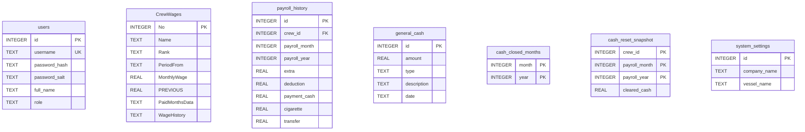

# 🚢 نظام إدارة رواتب أسطول السفن وصندوق القبطان
### ARN Ship Payroll & Master Cash Management System

---

## 📌 1. بطاقة تعريفية بالمشروع
* **اسم النظام:** ARN Ship Payroll System (نظام رواتب أسطول ARN)
* **المطور والمبرمج:** عبده رجب نصار (Abdou Ragab Nassar)
* **الجهة المالكة والناشرة:** شركة **ARN Technology**
* **سنة الإصدار:** 2026
* **حقوق الملكية:** حقوق النشر © 2026 لشركة ARN Technology. جميع الحقوق محفوظة.

---

## 🎯 2. نظرة عامة والهدف من المشروع
تطبيق مكتبي متكامل (Desktop Application) مصمم خصيصاً لإدارة الشؤون المالية والحسابية المعقدة لأطقم السفن البحرية والوحدات الملاحية، ويشمل:
1. حساب الأجور البحرية طبقاً للمعايير والاتفاقيات البحرية الدولية (قاعدة الـ 30 يوماً للشهر البحري).
2. متابعة دقيقة لسجل تغير الرواتب والترقيات عبر الزمن لكل بحار بأثر رجعي محفوظ (`WageHistory`).
3. إدارة سلف البحارة المباشرة (الكاش)، المشتريات (السجائر/الكانتين)، والحوالات البنكية الخارجية.
4. إدارة صندوق القبطان النقدية (Master Cash) ومتابعة المصروفات العامة والواردات، مع دعم خاص لتسليم واستلام العهدة البحرية بين القادة (`Handover Reset`).
5. توليد وتصدير كشوف المرتبات والتقارير الرسمية القابلة للطباعة بتنسيق احترافي.

---

## 🛠️ 3. الحزمة والبيئة التقنية (Tech Stack)
* **لغة البرمجة:** Python 3.10+ (تم الفحص والاعتماد على Python 3.14)
* **إطار عمل واجهة المستخدم:** PyQt6 (تطبيق مكتبي حديث بواجهة داكنة فاخرة Dark/Glassmorphism)
* **محرك قاعدة البيانات:** SQLite3 (محلي، عالي السرعة وبدون خوادم خارجية)
* **إطار الاختبارات وضمان الجودة:** pytest 9.x (يشمل 28 اختباراً آلياً شاملاً)
* **معايير التشفير:** PBKDF2-HMAC-SHA256 مع تمليح عشوائي (Salted Hashing)

---

## 📂 4. الهيكل المعماري للملفات (Directory & File Architecture)

```
d:\مشاريعي\مشروع الرواتب\
│
├── main.py                     # نقطة الانطلاق الرئيسية وتشغيل تطبيق PyQt6
├── config.py                   # التنسيقات العامة (CSS/QSS) والألوان الموحدة
├── database.py                 # تعريف جداول قاعدة البيانات والترحيل التلقائي
├── auth_service.py             # خدمة المصادقة، التشفير بـ PBKDF2 والحظر الأمني
├── report_service.py           # خدمة توليد التقارير المالية والطباعة بصيغة HTML/PDF
├── utils.py                    # الدوال المساعدة: الحسابات البحرية 30 يوماً ورتب الطاقم
│
├── ui_login.py                 # واجهة تسجيل الدخول ذات الأمان العالي والحسابات المقفلة
├── ui_dashboard.py             # لوحة القيادة والداشبورد الرئيسي ومحرك حساب الرواتب (PayrollEngine)
├── ui_accounting.py            # نافذة العمليات المحاسبية التفصيلية وتاريخ الراتب لكل بحار
├── ui_master_cash.py           # نافذة إدارة صندوق القبطان والعهد النقدية وإقفال الشهور
├── ui_analytics.py             # نافذة التحليلات البيانية والرسوم الإحصائية الشهرية
├── ui_admin.py                 # لوحة إدارة المستخدمين وصلاحيات الوصول والنسخ الاحتياطي
├── ui_add_crew.py              # نافذة إضافة وتعديل بيانات أعضاء الطاقم
│
├── arn_ship_payroll.db         # ملف قاعدة البيانات SQLite الفعلي للمشروع
├── pytest.ini                  # ملف إعدادات حزمة اختبارات Pytest
│
├── tests/                      # مجلد الاختبارات الآلية (TDD / Unit Tests)
│   ├── conftest.py             # Fixtures لقواعد بيانات اختبارية معزولة في الذاكرة
│   ├── test_utils.py           # اختبارات الحسابات البحرية والرتب
│   ├── test_auth_service.py    # اختبارات الأمان وتشفير كلمات المرور
│   ├── test_database.py        # اختبارات سلامة جداول وقواعد البيانات
│   └── test_report_service.py  # اختبارات الحسابات وتنسيق العملات
│
├── assets/                     # الأيقونات والخطوط والهوية البصرية لـ ARN
│   └── icons/                  # أيقونات الواجهة ووسائل التواصل الاجتماعي
├── LICENSE                     # وثيقة ترخيص وحماية حقوق الملكية الفكرية لـ ARN
└── PROJECT_SPECIFICATION.md    # وثيقة المواصفات الفنية والهيكلية الكاملة (هذا الملف)
```

---

## 🗄️ 5. مخطط وهيكل قاعدة البيانات (Database Schema)

تتكون قاعدة البيانات من 7 جداول رئيسية مترابطة:



### تفاصيل الجداول والأعمدة:

1. **`users` (المستخدمون والأمان):**
   - `id`: المعرف الرقمي الفريد.
   - `username`: اسم المستخدم الفريد للدخول.
   - `password_hash`: المفتاح المشفر بـ PBKDF2 (100,000 دورة تكرار).
   - `password_salt`: مفتاح التمليح العشوائي 32-byte مشفر Base64.
   - `full_name`: الاسم بالكامل المعروض في النظام.
   - `role`: الصلاحية (`Admin`, `Captain`, `Officer`).

2. **`CrewWages` (بيانات البحارة والرواتب):**
   - `No`: رقم السجل الملاحي.
   - `Name`: اسم البحار.
   - `Rank`: الرتبة الملاحية (مثل `MASTER`, `CH.ENG`, `A/B`).
   - `PeriodFrom`: تاريخ بدء الخدمة أو العقد (`YYYY-MM-DD`).
   - `MonthlyWage`: الراتب الشهري الحالي بالدولار.
   - `PREVIOUS`: الرصيد السابق المرحل (له أو عليه).
   - `PaidMonthsData`: سجل JSON بالأشهر المسواة والمغلقة (مثال: `{"2026-08": true}`).
   - `WageHistory`: سجل JSON يحفظ تاريخ الراتب قبل أي زيادة أو تعديل زمني.

3. **`payroll_history` (المعاملات الشهرية لكل بحار):**
   - مفتاح مركب فريد: `UNIQUE(crew_id, payroll_month, payroll_year)`.
   - `extra`: مكافآت وساعات إضافية (Overtime).
   - `deduction`: استقطاعات وخصومات.
   - `payment_cash`: سلف نقدية استلمها البحار.
   - `cigarette`: مبيعات الكانتين والدخان.
   - `transfer`: حوالات بنكية خارجية مرسلة لعائلة البحار.

4. **`general_cash` (حركات صندوق القبطان العامة):**
   - `id`, `amount`, `type` (`وارد` أو `صادر`), `description`, `date`.

5. **`cash_closed_months` & `cash_reset_snapshot` (إقفال وتسليم الصندوق):**
   - قفل الشهر لمنع التعديل على الصندوق النقدي بعد مراجعته.
   - أخذ لقطة للأرصدة النقدية المسلمة عند تصفير الصندوق واستلام قبطان جديد.

6. **`system_settings` (إعدادات السفينة والأسطول):**
   - حفظ اسم الشركة المالكة واسم السفينة لترويسة كافة الكشوف الرسمية.

---

## 🧮 6. خوارزميات ومنطق الحسابات (Financial & Maritime Algorithms)

### أ. خوارزمية الشهر البحري الدولي (قاعدة الـ 30 يوماً):
في الملاحة البحرية، تُحسب الأجور على أساس أن **كل شهر تجاري يساوي 30 يوماً بالضبط**:
$$\text{Days} = ((Y_2 - Y_1) \times 360) + ((M_2 - M_1) \times 30) + (D_2 - D_1) + 1$$
* **حالة الـ 31 يوماً:** إذا انتهت الفترة في يوم 31، يُخفض إلى 30 تلقائياً.
* **حالة شهر فبراير:** إذا امتد العمل من 1 فبراير إلى نهايته (28 أو 29)، يُحتسب شهراً كاملاً (30 يوماً).

### ب. خوارزمية الراتب وتاريخ الأجور (`WageHistory`):
عند تعديل راتب بحار في شهر معين، يقوم النظام بحفظ راتبه السابق في مصفوفة التاريخ حتى لا تتأثر الشهور الماضية السابقة لتاريخ الزيادة.

### ج. معادلات تصفية الرواتب:
1. **الأجر الأساسي الحالي:**
   $$\text{Current Basic} = \text{round}\left(\frac{\text{Current Wage}}{30} \times \text{Net Days Current}, 2\right)$$
2. **الأجور السابقة غير المسواة:**
   $$\text{Past Unpaid} = \sum \text{round}\left(\text{Days in Month} \times \frac{\text{Historical Wage}}{30}, 2\right)$$
3. **إجمالي الاستحقاق:**
   $$\text{Total Due} = \text{Current Basic} + \text{Extra} + \text{Previous Balance} + \text{Past Unpaid} - \text{Deduction}$$
4. **إجمالي المستلم:**
   $$\text{Total Received} = \text{Cash Advances} + \text{Cigarettes} + \text{Bank Transfers}$$
5. **صافي الرصيد المتبقي للبحار:**
   $$\text{Final Balance} = \text{Total Due} - \text{Total Received}$$

### د. معادلة صندوق القبطان وتسليم العهدة (`Master Cash Handover`):
$$\text{Current Net Cash} = \text{Total Income} - \text{Manual Expenses} - (\text{Total Crew Advances} - \text{Cleared Handover Advances})$$

---

## 🔒 7. منظومة الأمان والمصادقة (Authentication & Security)
1. **تشفير كلمات المرور:** تشفير لا رجعة فيه باستخدام خوارزمية `PBKDF2-HMAC-SHA256` مع `os.urandom(32)` كتمليح فريد لكل كلمة مرور.
2. **الحماية ضد هجمات القوة الغاشمة (Brute Force Protection):**
   - حظر الحساب مؤقتاً لمدة **5 دقائق** فور تسجيل **3 محاولات فاشلة متتالية**.
   - تصفير عداد المحاولات تلقائياً عند إدخال كلمة المرور الصحيحة.
3. **أذونات وصول متعددة الرتب (RBAC):**
   - **Admin:** صلاحيات مطلقة لإدارة المستخدمين وقواعد البيانات وحذف السجلات.
   - **Captain / Officer:** صلاحيات إدخال يومية ومتابعة الصندوق دون العبث بهيكل النظام.

---

## 🔔 8. وحدة التنبيهات الذكية وسجل التدقيق (Smart Alerts & Audit Trail)
* **سجل التدقيق (Audit Trail):** تسجيل كل عملية إدخال أو تعديل أو حذف أو تسجيل دخول مع المستخدم والتاريخ والوصف في جدول `audit_log`.
* **محرك التنبيهات الذكية:** 8 قواعد آلية تراقب رصيد الصندوق، سلف البحارة، انتهاء العقود والشهادات، الشهور المعلقة، محاولات الدخول، والخصومات الاستثنائية.
* **الإشعارات والشارات:** دعم نغمات ويندوز الصوتية وشارة الـ Badge التفاعلية على لوحة القيادة مع إمكانية تصدير تقارير رسمية بصيغة PDF.

---

## 🧪 9. نظام الاختبارات وضمان الجودة (QA & Testing Suite)
يعتمد المشروع على بنية اختبارات حديثة ومؤتمتة باستخدام `pytest`:
* **عدد الاختبارات الحالية:** 60 اختباراً آلياً شاملاً (نجاح بنسبة 100%).
* **تغطية الاختبارات:** الحسابات البحرية، المصادقة والأمان، قواعد البيانات، صندوق القبطان، كشوف المسير المجمع وتصدير Excel، وثائق وعقود البحارة، النسخ الاحتياطي وفحص السلامة، خدمة التقارير، سجل التدقيق، محرك التنبيهات، وخدمة الإشعارات.
* **قواعد البيانات الوهمية:** استخدام `conftest.py` لإنشاء قواعد بيانات اختبارية معزولة في مجلدات مؤقتة لحماية قاعدة البيانات الإنتاجية.
* **أمر تشغيل الاختبارات:**
  ```powershell
  python -m pytest
  ```

---

## 🚀 10. دليل التثبيت والتشغيل السريع

### المتطلبات:
* نظام تشغيل: Windows 10 / 11
* بيئة Python مثبتة الإصدار 3.10 أو أحدث.

### تثبيت الاعتماديات:
```powershell
pip install PyQt6 pytest reportlab
```

### تشغيل التطبيق:
```powershell
python main.py
```


### بيانات الدخول الافتراضية للنظام:
* **حساب المدير:**
  - اسم المستخدم: `admin`
  - كلمة المرور: `admin123`
* **حساب القبطان:**
  - اسم المستخدم: `captain`
  - كلمة المرور: `captain123`

---

## 📞 10. الدعم الفني والتواصل

تم تطوير هذا النظام بأعلى معايير الجودة البرمجية بواسطة:
* **المطور:** عبده رجب نصار (Abdou Ragab Nassar)
* **الشركة:** ARN Technology
* **WhatsApp:** [+201556710314](https://wa.me/201556710314)
* **Telegram:** [@ABDOURNASSAR95](https://t.me/ABDOURNASSAR95)
* **Facebook:** [abdouragab.nassar](https://www.facebook.com/abdouragab.nassar)
