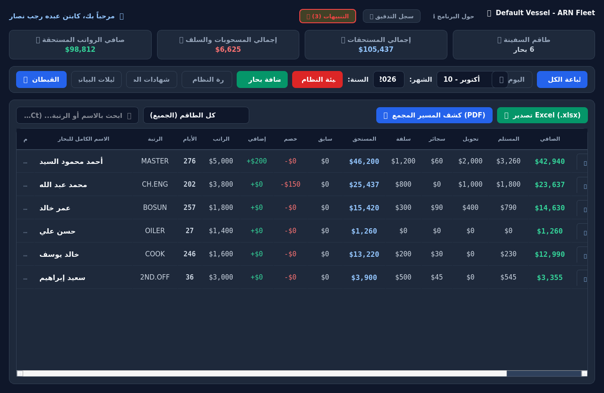
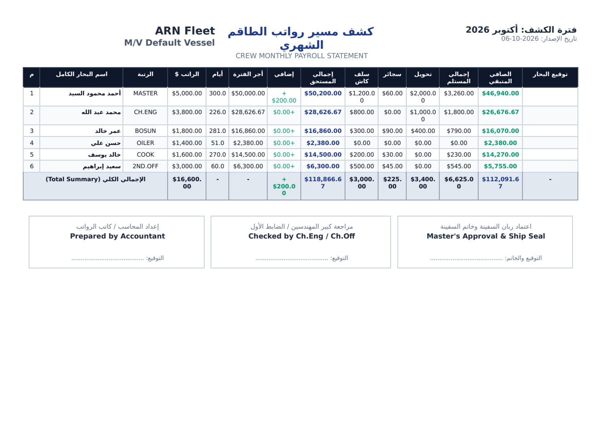
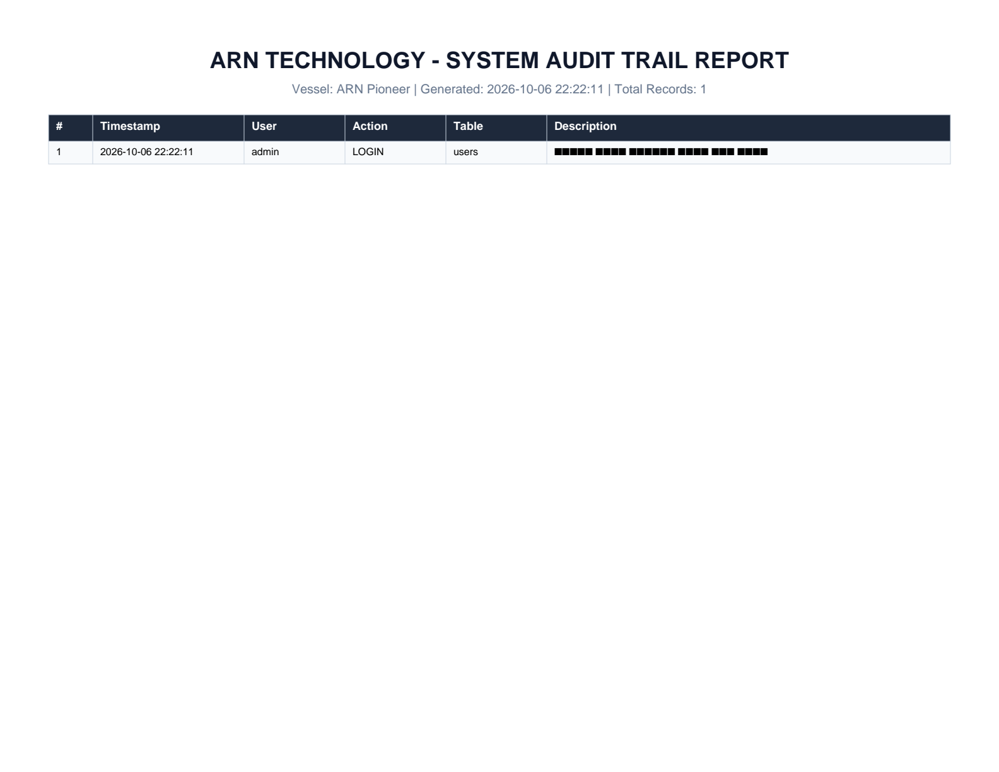
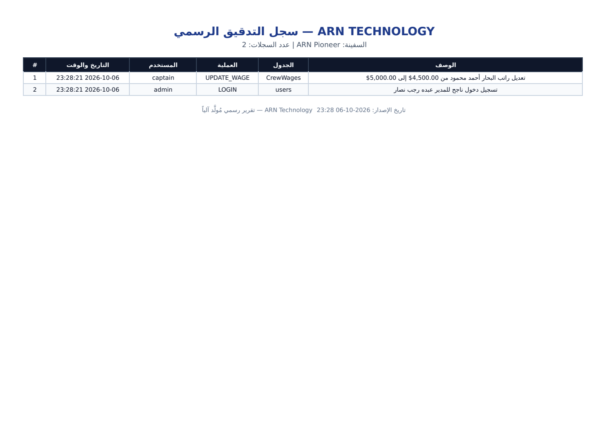
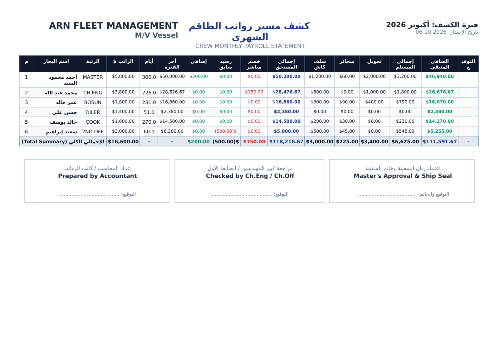

# 🔍 مراجعة فنية شاملة — ARN Ship Payroll System

**المراجعة:** تحليل كود + تشغيل فعلي + إعادة إنتاج الأخطاء (Code Review & Runtime Audit)
**المطور/المالك:** ARN Technology — عبده رجب نصار
**التاريخ:** 2026-10-06
**الفرع:** `arena/fff7430c-arn-ship-payroll` (من الالتزام `5fd7256`)
**نطاق المراجعة:** كل ملفات الكود (21 ملف Python رئيسي + 12 ملف اختبار = 8,634 سطر تطبيق + 833 سطر اختبار)

> ⚠️ هذه المراجعة **لم تعدّل أي ملف من كود التطبيق**. كل الأرقام والنتائج أدناه ناتجة عن تشغيل فعلي داخل بيئة معزولة، وصور الإثبات محفوظة بجوار هذا التقرير في مجلد `docs/analysis/`.

> 📌 **تحديثان لاحقان بعد هذا التقرير:**
> - **القسم 9:** تمّ تنفيذ حزمة P0 كاملةً (PR #21) والتحقق منها (71/71 اختباراً، CI أخضر).
> - **القسم 10:** **مراجعة شاملة ثانية** لكل الوحدات الـ22 بعد إصلاح P0 — كشفت **12 عيباً جديداً مؤكداً بالدليل**، أعلاها خطورةً `F12` (قاعدة البيانات تُوجد في *مجلد التشغيل* لا في مجلد ثابت → «اختفت بياناتي»)، و`F5` (رتبة غير معروفة تُرقّى **صامتاً** إلى Admin)، و`F1` (ثلاث طرق متضاربة لقراءة إعدادات الشركة + حفظ يُعلن نجاحاً كاذباً). اقرأ القسم 10 قبل الاعتماد على أي رقم في الجولة الأولى.
> - **القسم 11:** **تمّ تنفيذ حزمة P0 الثانية** (F12 + F5 + F1) مع 17 اختبار حراسة جديداً (**88/88 ناجحة**) وتحقق حيّ، وسُجّلت المهام #22–#32 (الحزمة P0 منها مُصلَحة، والبقية بمعايير قبول).

---

## 0) الملخّص التنفيذي

النظام **يعمل فعلياً** ويُقلع من الصفر بدون أي خطأ، ومحرك الحسابات البحرية الأساسي (قاعدة الـ 30 يوماً، تاريخ الرواتب `WageHistory`، الرصيد السابق، السلف والسجائر والحوالات) **صحيح ومُتحقَّق منه رقمياً**. مجموعة الاختبارات تمر بالكامل: **61/61 ✅**.

لكن المراجعة كشفت **9 عيوب مؤكدة** (بينها 3 ذات أثر مالي/قانوني مباشر) + مجموعة مخاطر بنيوية وأمنية مهمة قبل التسليم للعميل.

| # | العيب | الخطورة | الأثر المباشر |
|---|-------|---------|----------------|
| 1 | `reportlab` غير مذكور في `requirements.txt` | 🔴 حرجة | فشل اختبار مؤكد + **تعطّل تصدير PDF** لسجل التدقيق والتنبيهات على أي تثبيت نظيف |
| 2 | حذف بحار لا يحذف شهاداته/وثائقه (ولا تُنفَّذ قيود `CASCADE`) | 🔴 حرجة | السجلات اليتيمة تنتقل للبحار الجديد الذي يأخذ نفس الرقم + تنبيهات خاطئة |
| 3 | جداول الرواتب الرسمية (PDF/Excel) **تُسقط عمود الخصم** من الإجماليات | 🔴 حرجة | إجماليات مخالفة للوحة القيادة وللوثيقة الفنية (±150$ في المثال)، وخروج كشوف غير قابلة للتدقيق |
| 4 | تصدير PDF (سجل التدقيق/التنبيهات) يطبع العربية `▯▯▯` | 🟠 عالية | تقرير رسمي غير قابل للقراءة (مُثبت بالصورة) |
| 5 | `2nd.OFF / 3rd.OFF / 2nd.ENG / 3rd.ENG` لا تُطابق أي رتبة | 🟠 عالية | ترتيب خاطئ في الكشوف، فقدان الترقيم التلقائي، سقوط الضباط أسفل «الكاديت» |
| 6 | قاعدة `MONTH_NOT_CLOSED` فيها خطأان (15 يوماً بدل 45 + **شهر يُتجاهَل تماماً**) | 🟠 عالية | تنبيه إداري خاطئ/مبكر + شهر مالي لا يُفحَص أبداً |
| 7 | قاعدة `LOW_CASH` تجمع حركات **كل الشهور** | 🟠 عالية | رصيد الصندوق المحسوب ≠ رصيد شاشة صندوق القبطان (فرق 1,000$ في المثال) |
| 8 | `create_user.py` يعيد ضبط كلمة مرور المدير إلى `2314` | 🟡 متوسطة | قنبلة موقوتة إن نُفِّذ الملف على جهاز العميل |
| 9 | تدقيق ثابت صامت: 34 ملاحظة (استيرادات/متغيرات ميتة + سطر ميت يُوهم بخطأ حسابي) | 🟡 متوسطة | صعوبة الصيانة، ولغز حسابي يستهلك وقت المراجعة |

**أهم ما يجب معرفته:** الثلاثة الأوائل ليست «تحسينات» بل عيوب تمسّ دقّة الأرقام الرسمية وسلامة بيانات البحارة — أي أنها في قلب قيمة التطبيق للعميل.

> ✅ **تحديث:** العيوب الأربعة الأولى (حزمة P0) **تمّت معالجتها بالفعل** على الفرع الحالي — التفاصيل والأدلة البصرية في **البند 9** أدناه، والمهام المتبقّية (P1–P3) مُسجّلة كمهام GitHub مرقّمة (#6–#20).

---

## 1) منهجية التحقق (ما فعلته بالضبط)

| الخطوة | التفصيل |
|--------|---------|
| تجهيز البيئة | Python 3.11.2 + `venv` معزول + تثبيت `PyQt6, pytest, openpyxl, python-dateutil, reportlab` |
| تشغيل الاختبارات | `python -m pytest` → **61/61 ✅** (باستخدام منصة Qt الافتراضية `offscreen`) |
| إقلاع التطبيق | `python main.py` → إنشاء قاعدة البيانات وفتح شاشة الدخول بدون أي Traceback (12 ثانية تشغيل) |
| تحليل ثابت | `pyflakes` على كل الملفات → 34 ملاحظة |
| إعادة إنتاج أخطاء الحساب | سكربتات على قاعدة بيانات مؤقتة تحاكي بيانات سفينة حقيقية (6 بحارة، سلف، سجائر، حوالات، شهادات منتهية، صندوق قبطان) |
| إثبات بصري | لقطات حقيقية للنوافذ + تحويل كشوف PDF المُولَّدة إلى صور وقراءتها (المرفقات) |
| السلامة | لم يُلمس `arn_ship_payroll.db` الخاص بالمشروع؛ كل التجارب في مجلدات مؤقتة، والمتبقّي من ملفات الاختبار (`.db`) مُستثنى أصلاً في `.gitignore` |

---

## 2) ما يعمل بشكل صحيح (تحقّقت منه رقمياً قبل نقد أي شيء)



| الحالة المختبرة | المتوقع | الناتج الفعلي | الحكم |
|------------------|---------|----------------|-------|
| شهر 31 يوماً (1→31 يناير) | 30 يوماً بحرياً | 30 | ✅ |
| فبراير كامل (28 و29 يوماً) | 30 يوماً | 30 | ✅ |
| سنة كاملة (1 يناير → 31 ديسمبر) | 360 يوماً | 360 | ✅ |
| انضمام في 10/09 ومشاهدة سبتمبر | 21 يوماً | 21 يوماً → استحقاق 1,050$ لراتب 1,500$ | ✅ |
| بحار انضم 01/01 براتب 3,000 ومشاهدة سبتمبر (وضع «الشهر») | 27,000$ | 27,000$ (270 يوماً) | ✅ |
| ترقية الراتب مع `WageHistory` (9 شهور × 3,000 ثم 3,600) | 30,600$ | 30,600$ | ✅ |
| `PREVIOUS` سالب (له على الشركة) | يُخصَم من المستحق | 2,500$ بدل 3,000$ | ✅ |
| سلفة في شهر **مُسوّى** | تُستبعد من مدفوعات الشهر الحالي | استُبعدت (`received = 0`) | ✅ |
| الصندوق: وارد − صادر − سلف | 8,320 − 2,050 − 2,000 | 4,270$ (مطابق تماماً للشاشة) | ✅ |
| تصدير Excel لكشوف المسير/الصندوق | ملف سليم | فُتح وتحقّقت قيمه | ✅ |
| كشوف PDF بالعربية (المسير/الإيصال) عبر Qt | عربية سليمة | ✅ عربية سليمة تماماً (انظر `08_payroll_sheet_p1.png`) | ✅ |
| أمان الحسابات | PBKDF2 + تمليح عشوائي | تمليح مختلف لكل تشفير + تحقق صحيح | ✅ |
| حقن SQL | استعلامات مُعاملة (Parameterized) | لم أجد أي استعلام بتركيب نصي — ✅ نظيف | ✅ |
| 8 قواعد تنبيه مُبذَّرة تلقائياً | 8 | 8 | ✅ |

---

## 3) العيوب المؤكدة — بالدليل وإعادة الإنتاج


### 🔴 3.1 `reportlab` ناقص من الاعتماديات (والتصدير يفشل بصمت)

**الدليل:** `requirements.txt` يحتوي 4 حزم فقط (`PyQt6, python-dateutil, openpyxl, pytest`) بينما:
- `audit_service.py` ← `export_pdf()` يستورد `reportlab` (سطر 137)
- `alert_service.py` ← `export_pdf()` يستورد `reportlab` (سطر 542)
- `tests/test_audit_service.py:65` ← `test_export_pdf` يشترط النجاح

**إعادة الإنتاج (نتيجة فعلية):**
```
$ pip uninstall reportlab && python -m pytest
FAILED tests/test_audit_service.py::TestAuditService::test_export_pdf
assert False is True
⚠️ فشل تصدير PDF لسجل التدقيق: No module named 'reportlab'
→ 1 failed, 60 passed
```
كذلك في وقت التشغيل: `AuditService.export_pdf(...)` ترجع `False` وتطبع سطراً في الطرفية فقط، **ولا تُظهر أي رسالة داخل الواجهة** — أي أن المستخدم على جهاز جديد سيضغط «تصدير PDF» ولا يفهم لماذا لا يحدث شيء.

**الإصلاح:** إضافة `reportlab>=4.0.0` إلى `requirements.txt` (و`PyQt6-Qt6` ثابتة عند اللزوم)، وإظهار `QMessageBox` برسالة واضحة عند فشل التصدير بدل الاعتماد على `print`.

---

### 🔴 3.2 حذف بحار يترك شهاداته اليتيمة… وينقلها للبحار الجديد!

**الدليل:**
- `database.py:110` يعرّف: `crew_documents ... FOREIGN KEY(crew_id) REFERENCES CrewWages(No) ON DELETE CASCADE`
- لكن **لا يوجد أي `PRAGMA foreign_keys = ON`** في المشروع (61 موضع `sqlite3.connect` ولا واحد يفعّل القيود). القيمة الافتراضية في SQLite هي `0` — أي أن `CASCADE` **حرف على ورق لا يُنفَّذ أبداً**.
- `ui_dashboard.py:999-1000` (دالة `delete_crew`) تحذف جدولين فقط: `CrewWages` و`payroll_history`. لا `crew_documents`، ولا `alerts_history`، ولا لقطة العهدة، ولا `audit` (وهو صحيح للأخير).

**إعادة الإنتاج (نتيجة فعلية):**
```
PRAGMA foreign_keys default = 0
after deleting crew #7 -> crew_documents rows left = 1   (المتوقع 0)
new crew member #7 sees documents: [('شهادة الأهلية', '2027-01-01')]
```
أي أن **البحار الجديد** الذي يستلم رقم السجل `7` يظهر في نظامه شهادات البحار القديم، ويستمر في توليد تنبيهات انتهاء شهادات لا تخصه — وهو سيناريو واقعي جداً عند تسليم السفينة/تغيير الطاقم (وهو جوهر مشروعكم حسب وثيقة المواصفات).

**نفس المشكلة في «تهيئة النظام»:** `ui_dashboard.py:1130-1136` تحذف 5 جداول لكنها تُبقي `crew_documents` و`alerts_history`، فيرى القبطان الجديد تنبيهات السفينة السابقة ووثائق طاقمها.

**الإصلاح (أقل تغيير، آمن):**
1. تنفيذ الحذف الصريح داخل `delete_crew`: `DELETE FROM crew_documents WHERE crew_id=?` + `DELETE FROM cash_reset_snapshot WHERE crew_id=?` + إغلاق تنبيهات هذا البحار (`UPDATE alerts_history SET is_resolved=1 ... WHERE target_type='CREW' AND target_id=?`).
2. إضافة `PRAGMA foreign_keys = ON` في كل اتصال (أو مركزية الاتصال — انظر البند 4.4) لضمان أن `CASCADE` يعمل فعلاً كمصداق أخير.
3. إضافة نفس التنظيف إلى `reset_all_data`.

---

### 🔴 3.3 كشوف الرواتب الرسمية تُسقط «الخصم» من الإجماليات → إجماليات مخالفة للوحة القيادة

**الدليل:**
- `report_service.py` دالة `_normalize_crew_data` تعيد حساب «أجر الفترة» كالتالي: `period_wage = total_due − extra + deduction`، ثم `total_earnings = period_wage + extra` — أي **يُعاد الخصم إلى المستحق**.
- أعمدة كشف المسير (`generate_monthly_payroll_sheet`) وأعمدة Excel (`export_payroll_to_excel`، قائمة `headers` سطر 707-712) **لا تحتوي على عمود «خصم مباشر» ولا «الرصيد السابق»**، وبالتالي لا يمكن لأي مراجع أن يتتبّع من أين جاء «إجمالي المستحق».

**إعادة الإنتاج (بيانات تجريبية، وضع «الشهر»، أكتوبر 2026):**

| المؤشر | لوحة القيادة / Excel | كشف المسير PDF |
|--------|----------------------|----------------|
| إجمالي مستحقات الطاقم | **118,716.67$** | **118,866.67$** |
| البحار «محمد عبد الله» (CH.ENG) | 28,476.67$ | 28,626.67$ — الفرق **150$ بالضبط = قيمة الخصم المسجَّل** |
| الصافي النهائي لنفس البحار | 26,676.67$ (Excel) | 26,826.67$ (PDF) |



النتيجة: **ورقتان رسميتان من نفس البرنامج، لنفس الشهر، بنفس البيانات، تعطيان صافيين مختلفين**، والوثيقة الفنية (`PROJECT_SPECIFICATION.md` البند 6-ج-5) تنص على أن `Final Balance = Total Due − Total Received` — وهو ما يعمل به المحرك ويُخالفه كشف الـ PDF.

**الإصلاح المقترح:** إضافة عمودين إلى كشفي PDF وExcel: **«الرصيد السابق»** و**«خصم مباشر»** (قيمتان موجودتان أصلاً في `crew_data`)، وأن تُبنى «إجمالي المستحق» و«الصافي المتبقي» في الـ PDF من `total_due`/`final_balance` المحسوبين في المحرك بدل إعادة الحساب داخل خدمة التقارير (إزالة `period_wage` المنطقية المكرَّرة).

---

### 🟠 3.4 التقارير المُصدَّرة بـ reportlab تطبع العربية `▯▯▯`

**الدليل:** `audit_service.py:188/192` و`alert_service.py:595/599` تستخدم `FONTNAME = 'Helvetica'/'Helvetica-Bold'` بدون تسجيل خط عربي (`registerFont`/`TTFont`)، بينما أوصاف التدقيق عربية بالكامل.

**الإثبات البصري:** عمود الوصف العربي يظهر `▯▯▯▯ ▯▯▯▯ ▯▯▯▯▯`:



(بالمقابل: كشوف Qt العربية تظهر سليمة 100% — انظر `08_payroll_sheet_p1.png`، فالمشكلة محصورة في المسارين أعلاه.)

**الإصلاح:** تسجيل خط عربي مدمج (مثال: Cairo/Amiri أو DejaVuSans) عبر `pdfmetrics.registerFont(TTFont(...))` من مجلد `assets/fonts`، واستخدامه في كل جداول reportlab. (ملاحظة: إن كان التقرير موجَّهاً للتفتيش الأجنبي فيمكن إبقاء العامود إنجليزياً، لكن الأفضل توحيده.)

---

### 🟠 3.5 أربع رتب في هرمية النظام لا تُطابق أي رتبة فعلاً

**الدليل:** `utils.py` — `RANK_HIERARCHY` يحتوي رتباً بحروف صغيرة داخل القاموس (`'2nd.OFF', '3rd.OFF', '2nd.ENG', '3rd.ENG'`) بينما `get_base_rank` تقوم بـ `.upper()` على إدخال المستخدم قبل المقارنة، فتفشل المقارنة دائماً.

**نتيجة فعلية:**
```
MASTER   -> base=MASTER   sort_key=0
2nd.OFF  -> base=2ND.OFF  sort_key=18   ← مساوٍ لطول الهرمية (أسفل الكاديت!)
3rd.OFF  -> base=3RD.OFF  sort_key=18
3RD.ENG  -> base=3RD.ENG  sort_key=18
hierarchy entries that can never match: ['2nd.OFF','3rd.OFF','2nd.ENG','3rd.ENG']
```
**الأثر المرئي:** في كشف المسير المولَّد ظهر «سعيد إبراهيم 2ND.OFF» في **آخر صف** أسفل «الكوك» و«الأويلر»، وتَُفقد الترقيم التلقائي للرتب المتكررة (`2nd.OFF 1 / 2nd.OFF 2`).

**الإصلاح:** توحيد حالة الأحرف: إما `[r.upper() for r in RANK_HIERARCHY]` داخل `get_base_rank`، أو تخزين الهرمية بحروف كبيرة أصلاً. وإضافة اختبار لكل رتبة من الـ 18 (انظر خطة الاختبارات).

---

### 🟠 3.6 قاعدة «الشهر المالي غير المقفل» فيها خطأان — والمفارقة أنها القاعدة الوحيدة بلا اختبار

**الدليل:** `alert_service.py:256-286`:
1. **الخطأ الأول:** الشرط `if days_passed >= (days_threshold - 30)` أي `45 − 30 = 15` يوماً فقط بعد نهاية الشهر، بينما القاعدة المنصوص عليها في الوثيقة ووصف القاعدة «أكثر من 45 يوماً».
2. **الخطأ الثاني (الأخطر):** حساب الشهور المستهدفة `(now.replace(day=1) - timedelta(days=months_back * 31))` بـ 31 يوماً ثابتة، ما يجعل الفحص يقفز فوق الشهر الماضي.

**إعادة الإنتاج (نتيجة فعلية، اليوم = 2026-10-06):**
```
B7) alerts fired for months: ['08-2026', '07-2026']
    sample: تنبيه إداري: شهر (08-2026) المالي لم يُقفل بعد...
```
أي أن **شهر سبتمبر 2026 (الشهر المنتهي للتو) لا يُفحَص إطلاقاً**، ويُفحَص يوليو مكانه — وسيبقى يُتجاهَل في الأشهر التالية بنفس النمط.

**الإصلاح:** استبدال حساب الشهور بـ `dateutil.relativedelta(months=-1)` و`-2` (المكتبة مُضمَّنة أصلاً في المشروع)، وتصحيح الشرط إلى `days_passed >= days_threshold` (45).

---

### 🟠 3.7 قاعدة «رصيد الصندوق منخفض» تحسب رصيداً مختلفاً عن الشاشة

**الدليل:** `alert_service.py:120-127` — تجمع `SUM(amount)` لكل حركات `general_cash` بلا أي فلترة شهرية، وتخصم `SUM(payment_cash)` لكل السلف في كل الشهور، بينما شاشة صندوق القبطان (`ui_master_cash.load_cash_data`) تحسب الشهر المحدد فقط وتطرح السلف المصفاة الخاصة بنفس الشهر.

**نتيجة فعلية على بيانات تجريبية:** الشاشة تعرض صافي **4,270.00$** بينما المحرك المستخدَم في التنبيه يحسب **3,270.00$** (فرق 1,000$ = سلف شهور سابقة). النتيجة: التنبيه قد يُطلق «حرجاً» على صندوق سليم، أو يغفل صندوقاً منخفضاً فعلاً.

**الإصلاح:** توحيد مصدر الحقيقة: إما استدعاء دالة الحساب المركزية للصندوق للشهر الحالي (أو آخر شهر مفتوح)، أو إضافة `WHERE date BETWEEN ? AND ?` و`WHERE payroll_year/month` كما تفعل الشاشة. والأفضل: نقل حساب الصندوق إلى خدمة واحدة `CashService` تستخدمها الشاشة والتنبيهات والتقارير معاً.

---

### 🟡 3.8 `create_user.py` يعيد ضبط كلمة مرور المدير

```python
auth.create_test_user("admin", "2314", "مدير النظام", "admin")
```
الملف لا يُستدعى تلقائياً (آمن)، لكن مجرد وجوده في مجلد التسليم يعني أن أي شخص يُشغّله يستولي على حساب المدير بكلمة مرور معروفة. **الإصلاح:** حذفه من الحزمة النهائية، أو تحويله إلى أداة إدارية تطلب كلمة مرور جديدة من الطرفية (`getpass`) ولا تعمل إلا بمعامل صريح.

---

### 🟡 3.9 ملاحظات ثابتة صامتة (ولغز حسابي مزعج للمراجعة)

```
34 findings: استيرادات غير مستخدمة (Qt/GUI/...)، متغير `now` ميت في اختبار،
f-string بدون عناصر نائبة، أبرزها السطر التالي:
ui_dashboard.py:93   prev_month_end = (dt_selected_start - relativedelta(days=1)).strftime("%Y-%m-%d")
```
هذا السطر **ميت تماماً وظيفياً** — لأنه يُعاد حسابه بشكل صحيح في السطر 145 (`calculate_days_30(period_from, prev_month_end)`)، لكنه يبدو كأنه نهاية الشهر الحالي ناقص يوم، ما يوقع المراجع في شك بوجود خطأ في حساب الشهور. **يجب حذفه** لتوفير وقت أي مراجعة مستقبلية.

---

## 4) المخاطر الأمنية والبنيوية (بدون إعادة إنتاج — مراجعة تصميمية)

### 4.1 كلمة مرور عالقة في الذاكرة
`auth_service.py:11` — عدّاد المحاولات الفاشلة والفترة المتبقية للحظر محفوظة في قاموس داخل الكائن: يكفي **إغلاق البرنامج وفتحه** لإلغاء الحظر المفروض (3 محاولات/5 دقائق). كما أن العدّاد يُصفَّر إذا أعاد المستخدم تشغيل البرنامج، وهو ما يبطل فعالية الحماية ضد القوة الغاشمة (Brute Force). **الإصلاح:** تخزين العدّاد و`lock_until` في جدول `users` أو جدول `login_attempts`.

### 4.2 «الفشل المفتوح» في المصادقة
عند أي خطأ في قاعدة البيانات (ملف مقفول، قاعدة تالفة، عمود مفقود) يُعاد للمستخدم: *«اسم المستخدم أو كلمة المرور غير صحيحة»* — أي أن المستخدم الشرعي يُخبَر بأن بياناته خطأ وهو محق، ويُستهلك عدّاد الحظر لسبب لا علاقة له بكلمة المرور. **الإصلاح:** تمييز رسالة أخطاء النظام («تعذّر الوصول لقاعدة البيانات...») عن فشل التحقق.

### 4.3 الصلاحيات (RBAC) في الواجهة فقط
الأزرار مخفية حسب الدور (`ui_dashboard.py:412-455`، 5 مواضع)، لكن **لا يوجد أي تحقق صلاحية داخل الدوال نفسها**: `reset_all_data` (حذف كل البحارة والصندوق!) متاح لدور `captain`، و`delete_crew` و`open_admin` لا تتحققان من الدور مطلقاً. كما أن كل خدمات الواجهات الأخرى (`ui_master_cash`, `ui_crew_documents`, `ui_analytics`) لا تستقبل هوية المستخدم أو دوره أساساً — أي أن **أي استدعاء برمجي مباشر يتجاوز الصلاحيات تماماً**، والتدقيق في هذه الشاشات يُسجَّل باسم ثابت `"ADMIN"` ورقم `1` (9 مواضع). **الإصلاح:** تمرير `current_user` إلى كل النوافذ واستخدامه في التدقيق، مع فحوص صلاحية داخل الدوال الحرجة (حذف/إقفال شهر/تسليم عهدة/تهيئة النظام).

### 4.4 تشتّت مسار قاعدة البيانات (30 موضعاً صلباً `'arn_ship_payroll.db'`)
الواجهات تقبل `db_path` وتُمرِّره في `ui_master_cash/ui_crew_documents/ui_analytics/ui_alerts_center`، لكن:
- `ui_accounting.py:136, 151, 699` — **مثبّت على المسار الحرفي** ← أي تعديل على بحار من شاشة الحسابات يُكتب في ملف آخر غير الذي تعرضه اللوحة إذا اختلف مسار التشغيل، والاختبارات لا تستطيع اختبار هذه الشاشة أصلاً.
- `report_service.py:39, 513, 902` — تقرأ اسم الشركة/السفينة من الملف الحرفي.
**الإصلاح:** ثابت واحد في `config.py` + `PRAGMA foreign_keys=ON` + دالة `Database.get_connection()` مركزية تعيد اتصالاً واحداً مُعدّاً، ثم استبدال 61 موضع `sqlite3.connect` تدريجياً.

### 4.5 النسخ الاحتياطي والاستعادة
- `ui_admin.create_backup` يستخدم `shutil.copy2` على ملف SQLite **مفتوح وقيد الكتابة** (لا `sqlite3 .backup` ولا `VACUUM INTO` ولا `wal_checkpoint`) → احتمال نسخة غير متسقة.
- `restore_backup` ينسخ فوق الملف الحي **دون إعادة تهيئة الاتصالات/النوافذ المفتوحة** → الشاشات تظل تعرض بيانات قديمة حتى يعيد المستخدم تشغيل البرنامج يدوياً (ولا يُطلب منه ذلك في أي رسالة).
- لا نسخة احتياطية تلقائية قبل عمليات الخطر (تهيئة النظام / الاستعادة) عدا ملف `.before_restore` داخل مجلد التطبيق.
**الإصلاح:** `sqlite3.Connection.backup()` أو `VACUUM INTO` + نسخة تلقائية قبل «تهيئة النظام» + رسالة «يجب إعادة تشغيل البرنامج» بعد الاستعادة (أو إعادة بناء النوافذ برمجياً).

### 4.6 قابلية النقل والهوية البصرية (مقابل `AGENTS.md`)
لا ينفّذ المشروع حتى الآن البنود المتفق عليها في ملف هوية ARN:
- لا وجود لدالة `get_resource_path` (المطلوبة لمسارات PyInstaller العربية) — الصور تُقرأ بمسارات نسبية `assets/icons/*.png` (تعمل من مجلد العمل فقط).
- لا `setWindowIcon` ولا أيقونة نافذة، ولا `QLocalServer/QLocalSocket` لمنع النسخ المتعددة، ولا `hiddenimports`، ولا `.spec` / `.iss`.
- تاريخ `handover_reset` يُسجَّل بتاريخ اليوم الحقيقي (`ui_master_cash.py:666`) وليس بتاريخ الشهر المعروض → محاضر العهدة تُؤرَّخ خطأً عند العمل على شهر سابق.

---

## 5) جودة الكود والصيانة (قياس كمي)

| المؤشر | القيمة | الملاحظة |
|--------|--------|----------|
| أسطر التطبيق / الاختبارات | 8,634 / 833 | نسبة اختبار ~10% |
| عدد الاختبارات | 61 | تغطية جيدة للخدمات، صفر للواجهات |
| دوال ضخمة | 9 دوال > 160 سطراً | أطولها `ui_dashboard.build_ui` (263)، `ui_accounting.build_ui` (255)، `database.init_db` (208)، `ui_dashboard.load_crew_data` (173) |
| التوثيق | 67 من 227 دالة (~30%) | `auth_service` و`ui_login` و`ui_analytics` بلا أي توثيق |
| `try/except` | 119 / 120 | منها **6 `except` فاضية** (`ui_accounting`, `ui_dashboard`) |
| `print()` في الإنتاج | 27 | أبرزها مسارات التصدير وسجل التدقيق — غير مرئية للمستخدم |
| `pyflakes` | 34 ملاحظة | لا أخطاء منطقية قاتلة، لكن فوضى استيرادات |
| تكرار منطق مالي | 3 مواضع | `PayrollEngine.load_crew_data` ↔ `ui_analytics` ↔ `report_service._normalize_crew_data` — وهذا التكرار هو السبب الجذري للعيب 3.3 |

**إيجابيات تستحق التثبيت:** استعلامات SQL مُعاملة بالكامل (لا حقن)، `html.escape` على كل بيانات المستخدم في تقارير HTML/Qt، تصميم داكن موحّد أنيق، محرك تنبيهات بفترات تهدئة (Cooldown) وسجل تدقيق شامل، وواجهة Excel/PDF غنية.

---

## 6) خارطة إصلاح مرتّبة بالأولوية

### المرحلة P0 — قبل أي تسليم (يوم عمل واحد)
1. `requirements.txt` += `reportlab`، وإظهار رسالة فشل واضحة لكل مسارات التصدير (عيب 1).
2. تنظيف حذف البحار + تفعيل `PRAGMA foreign_keys=ON` + تنظيف «تهيئة النظام» (عيب 2).
3. تصحيح الإجماليات في كشفي PDF/Excel بإضافة عمودي «الخصم» و«الرصيد السابق» وبناء الصافي على مخرجات المحرك (عيب 3).
4. إضافة خط عربي لتقارير reportlab (عيب 4).

### المرحلة P1 — خلال الأسبوع نفسه
5. توحيد حالة أحرف `RANK_HIERARCHY` + اختبار لكل الرتب (عيب 5).
6. تصحيح قاعدتي `MONTH_NOT_CLOSED` و`LOW_CASH` (عيوب 6، 7).
7. حذف `create_user.py` أو تأمينه، وإزالة السطر الميت `ui_dashboard.py:93` (عيوب 8، 9).
8. مركزة مسار قاعدة البيانات + تفعيل القيود لكل الاتصالات (مخاطر 4.4).

### المرحلة P2 — تحسينات هيكلية
9. `CashService` و`AuthService` بمركزية واحدة تستخدمها الشاشات والتنبيهات والتقارير (نفس مصدر الحقيقة).
10. تمرير هوية المستخدم لكل النوافذ + فحوص صلاحية داخل الدوال + تدقيق باسم المستخدم الحقيقي (مخاطر 4.3).
11. نقل عدّاد المحاولات الفاشلة إلى قاعدة البيانات (مخاطر 4.1).
12. `create_backup` بـ `VACUUM INTO` + نسخة تلقائية قبل «تهيئة النظام» (مخاطر 4.5).
13. تطبيق بنود هوية ARN: `get_resource_path`, أيقونة النافذة، منع النسخ المتعددة، `hiddenimports`, تواريخ محاضر العهدة (مخاطر 4.6).
14. تجميع نافذة «حول البرنامج» في مكوّن مشترك (نفس النافذة منسوخة الآن بين `ui_dashboard` و`ui_login`).

### خطة اختبارات مقترحة (قفل السلوك بعد كل إصلاح)
| اختبار جديد | يحمي من |
|--------------|---------|
| `test_ranks_roundtrip_all_hierarchy` (18 رتبة → base/sort_key متوقّعان) | عيب 5 |
| `test_delete_crew_removes_documents_and_snapshots` | عيب 2 |
| `test_payroll_sheet_totals_match_engine` (يقارن مجموع الكشف بمجموع `total_due`) | عيب 3 |
| `test_export_pdf_contains_arabic_pdf_markup` (فحص وجود خط/سلسلة عربية بعد الترميز) | عيب 4 |
| `test_month_not_closed_checks_previous_month` (بتاريخ مُثبَّت) | عيب 6 |
| `test_low_cash_uses_selected_month_only` | عيب 7 |
| `TestPayrollEngine::test_settled_month_without_payment` (تثبيت السلوك: هل الأجر يُسقط أم يُرحَّل؟) | غموض محاسبي |
| اختبار واجهات بلا شاشة: `QT_QPA_PLATFORM=offscreen` + إنشاء `MainDashboard`/`MasterCashWindow` ضد قاعدة مؤقتة | انحدار الواجهات (0% حالياً) |

**وأخيرًا:** إضافة `reportlab` إلى CI خطوة كافية لجعل الفشل الحالي مستحيل التكرار، والأفضل تشغيل الـ CI على `ubuntu-latest` أيضاً مع `QT_QPA_PLATFORM=offscreen` لأن بناء Windows الحالي (`.github/workflows/ci.yml`) لا يلتقط مشاكل المسارات/الحزم.

---

## 7) الملحق — الأدلة البصرية وأوامر إعادة الإنتاج

| الملف | الوصف |
|-------|-------|
| `01_login.png` | شاشة الدخول — تصميم زجاجي سليم |
| `03_dashboard_data.png` | لوحة القيادة ببيانات 6 بحارة + شارة التنبيهات (3) |
| `04_accounting.png` | شاشة حسابات البحار — شبكة الشهور (تسوية/تفتيح) |
| `05_master_cash.png` | صندوق القبطان: وارد 8,320 − صادر 2,050 − سلف 2,000 = **4,270$** |
| `06_analytics.png` | التحليلات البيانية |
| `07_audit_pdf_render.png` | 🐞 **إثبات العيب 4:** وصف التدقيق العربي يظهر `▯▯▯` |
| `08_payroll_sheet_p1.png` | 🐞 **إثبات العيب 3:** كشف المسير (إجمالي 118,866.67 وصف «سعيد إبراهيم 2ND.OFF» في آخر صف بسبب العيب 5) |

**أوامر التشغيل المستخدمة (على Windows تُنفَّذ بدون `LD_LIBRARY_PATH` وبدون `QT_QPA_PLATFORM`):**

```powershell
# 1) الاختبارات
python -m pytest

# 2) إعادة إنتاج فشل الاعتماديات
pip uninstall reportlab
python -m pytest tests/test_audit_service.py -k export_pdf

# 3) تحليل ثابت
pip install pyflakes
python -m pyflakes *.py tests/*.py

# 4) التحقق من الرتب
python -c "from utils import get_base_rank, get_rank_sort_key; print(get_base_rank('2nd.OFF'), get_rank_sort_key('2nd.OFF'))"

# 5) التحقق من تخطي الشهر في قاعدة MONTH_NOT_CLOSED
python -c "import tempfile,os,sqlite3; from database import init_db; from alert_service import AlertService; d=os.path.join(tempfile.mkdtemp(),'a.db'); init_db(d); AlertService(d).check_month_not_closed(); print(sqlite3.connect(d).execute('select target_name from alerts_history').fetchall())"
```

---

---

## 8) مقترحات التطوير والارتقاء (أفكار قابلة للتنفيذ)

> هذه المقترحات **إضافية** على قائمة الإصلاحات (البند 6). رتّبتها حسب **الأثر على العميل ÷ الجهد**، ومع كل مقترح تقدير زمني واقعي لمطوّر واحد.

### 8.1 حزمة «جاهزية التسليم» — أسبوع واحد (أعلى أثر فوري)

| # | المقترح | لماذا؟ | الجهد |
|---|---------|--------|-------|
| 1 | **تنفيذ حزمة P0** (البند 6-أ) قبل أي ميزة جديدة | الأرقام الرسمية وسلامة البيانات قبل كل شيء | 1 يوم |
| 2 | **سند استلام راتب موقّع + إقرار استلام** — وثيقة مطبوعة لكل بحار تُسجَّل معها «استلمت بتاريخ / عن طريق» في قاعدة البيانات | حماية قانونية لربان السفينة، ومطلب فعلي في اتفاقية العمل البحري **MLC 2006 — القاعدة A2.2:** للبحار الحق في حساب أجور شهري مفصّل. النظام يطبع إيصالاً الآن لكنه لا يُسجّل أي إقرار بالاستلام | 1–2 يوم |
| 3 | **اعتماد مزدوج وإقفال على مستوى الرواتب** — حالياً أي مستخدم يفتح شاشة الحسابات يستطيع تعديل أي شهر بأثر رجعي. المقترح: حالة للشهر (مفتوح / مُسوّى / مُعتمد) ولا يُفتح إلا بإجراء موثّق، مع تسجيل «من اعتمد ومتى» | منع التلاعب الرجعي، وهو جوهر أي نظام رواتب رسمي | 1–2 يوم |
| 4 | **سجل أحداث (Logging) إلى ملف** في `%LOCALAPPDATA%\ARN\logs` مع تدوير الملفات + زر «تصدير تقرير تشخيص» من شاشة إدارة النظام | **حرج جداً:** في نسخة PyInstaller بنمط `--windowed` لا يوجد كونسول، ومعنى ذلك أن الـ 27 موضع `print()` الحالية **تختفي تماماً** في نسخة العميل؛ أي عطل سيصبح بلا أي أثر للتشخيص | نصف يوم |
| 5 | **نسخة احتياطية تلقائية + نسخة قبل العمليات الخطر** (تهيئة النظام / الاستعادة / إقفال شهر) مع تدوير آخر 10 نسخ، وخيار مزامنة النسخ إلى مجلد OneDrive/شبكة | البيانات لا تُقدَّر بثمن، وحالياً النسخة الاحتياطية يدوية فقط | نصف يوم |

### 8.2 مقترحات هندسية (استقرار وصيانة)

| # | المقترح | التفصيل الفني | الجهد |
|---|---------|----------------|-------|
| 6 | **طبقة وصول بيانات مركزية** | 61 موضع `sqlite3.connect` و30 موضع مسار صلب. المقترح: وحدة `db.py` واحدة تُرجع اتصالاً مُعدّاً: `PRAGMA foreign_keys=ON` + `journal_mode=WAL` + `busy_timeout=5000` + `row_factory`. و**WAL مهم هنا تحديداً** لأن النظام يعمل بخيوط متعددة (خيط فحص التنبيهات يكتب في `alerts_history` بينما الواجهة تكتب في نفس اللحظة) — بدون WAL ستظهر أخطاء «database is locked» عند العميل بلا سبب واضح | 1 يوم |
| 7 | **فهارس ناقصة + تقليل التحميل** | الموجود: فهارس `audit_log` و`alerts_history` و`crew_documents` فقط. الناقص: `payroll_history(crew_id, payroll_year, payroll_month)` و`general_cash(date)` و`cash_reset_snapshot(payroll_month, payroll_year)`. كما أن `PayrollEngine.load_crew_data` تقرأ **كل** سجلات `payroll_history` عند كل تحديث ثم تُجمِّع في بايثون — مع 3 سنوات × 20 بحار تصبح البطء ملحوظاً؛ المقترح فلترة بالمدى الزمني | 2–3 ساعات |
| 8 | **فصل محرك الرواتب عن الواجهة** | انقل معادلات `load_crew_data` إلى `payroll_engine.py` نقي (بلا PyQt وبلا SQLite — يستقبل البيانات ويُرجع النتائج)، ثم **اختبارات ذهبية (Golden Tests)**: خزّن 3–5 كشوف رواتب حقيقية معتمدة من عميلكم وتأكد أن المحرك يعطي نفس الأرقام بالقرش. هذه الخطوة وحدها تجعل أي إصلاح مستقبلي مأموناً | 2 أيام |
| 9 | **سياسة تقريب موحّدة** | المبالغ `float` وتُقرَّب بـ `round()` (تقريب بايثون = banker's rounding) في مواضع متعددة. المقترح: تعريف سياسة واحدة (تقريب لنصف القرش لأعلى `ROUND_HALF_UP`) وتطبيقها في نقطة مركزية واحدة، مع اختبار حدودي (±0.005). فروق القروش تراكمياً = مشكلة ثقة مع المحاسبين | 3 ساعات |
| 10 | **حذف ناعم بدل الحذف النهائي** | أنظمة الرواتب لا تحذف سجلاً نهائياً. المقترح: عمود `is_active` في `CrewWages` + شاشة «الأرشيف/المحذوفات» بدل `DELETE` المباشر مع بقاء التدقيق كاملاً. هذا يحلّ جزئياً أيضاً العيب رقم 2 (لا إعادة استخدام لمعرّفات البحارة) | 1 يوم |
| 11 | **تقسيم الدوال الضخمة تدريجياً** | 9 دوال > 160 سطراً (أطولها `build_ui` بـ 263 سطراً). كل `build_ui` تُقسَّم إلى دوال أصغر (`_build_header`, `_build_kpi_row`, `_build_table`) بلا أي تغيير سلوكي — يقلّل مخاطر أي تعديل لاحق بشكل هائل | 1–2 يوم |
| 12 | **ترحيلات مُصدَّرة (Migrations)** | حالياً `init_db` تعتمد `try/except ALTER TABLE` في 208 أسطر. المقترح: جدول `schema_version` + قائمة ترحيلات مرقّمة تُنفَّذ مرة واحدة فقط — يجعل تحديث النسخ عند العملاء آمناً وقابلاً للتتبّع | نصف يوم |

### 8.3 مقترحات المنتج (قيمة تجارية جديدة)

| # | المقترح | القيمة التجارية | الجهد |
|---|---------|------------------|-------|
| 13 | **حزمة الامتثال للعمل البحري (MLC 2006 / PSC)** — تقرير «حساب أجور البحار» الشهري الرسمي + كشف حالة العقود + مصفوفة الشهادات | يفتح النظام لباب التفتيش البحري (Port State Control / Vetting) وسوق شركات إدارة السفن، وهو مطلب يخضع له القبطان فعلياً عند التفتيش | 2–3 أيام |
| 14 | **تعدد السفن (Fleet Mode)** — جدول `vessels` وربط كل البيانات بالسفينة، مع تقرير مجمّع للأسطول | حالياً `system_settings` تحمل سفينة واحدة فقط؛ أي شركة تدير أكثر من سفينة ستضطر لتشغيل نسخ منفصلة وتفقد الرؤية الموحّدة. الشركة المالكة ستنمو — والأفضل أن ينمو النظام معها | 3–4 أيام |
| 15 | **مرفقات الشهادات (صور / PDF ممسوحة)** — تُخزَّن في مجلد `attachments/` مع بصمة ملف، وتُفتح من شاشة الوثائق | يجعل النظام مرجعاً كاملاً للتفتيش: لا أوراق مبعثرة، ولا شهادات مفقودة عند الطلب | 2–3 أيام |
| 16 | **بدلات وهيكل أجر مرن** — راتب أساسي + بدلات ثابتة (بدل إجازة / عمولة / بدل سفر) + معدل ساعات إضافية لكل رتبة | حالياً كل شيء في «مكافأة/خصم» يدوي؛ الهيكل الرسمي يزيد دقة المحاسبة ويجعل الكشف مفهوماً لجهات الاعتماد | 2–3 أيام |
| 17 | **تعدد العملات وأسعار الصرف** — جدول أسعار + تاريخ وطريقة صرف الحوالة (الفروق والعمولات جزء من الواقع الفعلي) | النظام بالدولار فقط حالياً، وأي عمولة تحويل تُدفع اليوم بشكل غير موثّق | 2 أيام |
| 18 | **وضع تعدد المستخدمين الصحيح** | ⚠️ تنبيه: **لا** تضعوا ملف SQLite على OneDrive/مشاركة شبكة أثناء الاستخدام (تعارضات وفساد محتمل). الطريق الصحيح إن احتِجتم العمل الجماعي: خادم صغير (FastAPI + SQLite/Postgres على جهاز واحد) والنسخة المكتبية تبقى للعمل بلا إنترنت ثم تتزامن | مشروع مستقل |

### 8.4 بناء وإصدار احترافي (بنود هوية ARN غير المنفَّذة)

| # | المقترح | التفصيل | الجهد |
|---|---------|---------|-------|
| 19 | **سكربت بناء موحّد `build_release.ps1`** ينفّذ ما ورد حرفياً في `AGENTS.md`: تنقية `dist/build/__pycache__` ← PyInstaller `.spec` (مع `hiddenimports` للشبكة المحلية) ← Inno Setup ← **توقيع SHA256 مع طابع زمني RFC-3161** ← التحقق أن `TimeStamperCertificate` غير فارغ ← `Unblock-File` على كل مسارات التوزيع ← زرع الشهادة في `Root/TrustedPublisher` | نصف–1 يوم (بنودكم موثّقة وجاهزة للتنفيذ) |
| 20 | **أيقونة النافذة + `get_resource_path` + منع النسخ المتعددة** (`QLocalServer/QLocalSocket`) — مذكورة في هويتكم ولم تُنفَّذ بعد | نصف يوم |
| 21 | **رقم إصدار مركزي + `CHANGELOG.md` + فحص تحديث بسيط** (يقرأ ملف إصدار من الإنترنت ويخبر المستخدم بوجود تحديث) | نصف يوم |
| 22 | **توسيع CI** إلى `ubuntu-latest` مع `QT_QPA_PLATFORM=offscreen` (المسار الحالي Windows فقط)، + `ruff`، + بوابة تغطية، + `pytest-qt` لاختبار الواجهات، + رفع ملفات البناء كـ Artifacts | 1 يوم |
| 23 | **تحديث الوثائق المتأخرة** — `PROJECT_SPECIFICATION.md` يسرد جداول ووحدات وأرقام اختبارات قديمة (الواقع: 11 جدولاً، 21 وحدة، 61 اختباراً). المقترح: توليد مخطط ERD من قاعدة البيانات فعلياً بسكربت، وإضافة دليل مستخدم مصوّر للمحاسب على السفينة + مساعدة داخلية (F1) | 1 يوم |

### 8.5 لو كنت مكانك — الخمسة الأوائل بالترتيب

1. **حزمة P0 الأربعة** (يوم واحد) — تجعل النسخة الحالية قابلة للتسليم باحترام.
2. **الـ Logging إلى ملف + طبقة قاعدة البيانات المركزية (WAL / foreign_keys)** (يوم واحد) — أكبر عائد مقابل الجهد، ويمنع بلاغات دعم غامضة.
3. **إقفال واعتماد الشهور + سند استلام الراتب** (يومان) — يحوّل النظام من «أداة حسابية» إلى «سجل قانوني».
4. **فصل محرك الرواتب + الاختبارات الذهبية** (يومان) — تأمين مستقبلي لكل تعديل قادم.
5. **سكربت البناء الموقّع** (يوم واحد) — إغلاق فجوة التسليم/التوقيع المذكورة في هوية ARN.

**المجموع ≈ أسبوع عمل** يرفع المشروع من «يعمل بشكل جيد» إلى «منتج جاهز للتسليم التجاري والتدقيق البحري».

---

---

## 9) حالة التنفيذ — تمّت معالجة حزمة P0 ✅

> نُفِّذت الإصلاحات على الفرع `arena/fff7430c-arn-ship-payroll`، والمجموعة الكاملة للاختبارات تمر الآن **71/71** (كانت 61، أُضيف 10 اختبارات حراسة). ولم يُضَف أي اعتماد خارجي — بل أُلغيت حاجة المشروع إلى `reportlab` نهائياً.

| العيب | ما تم فعلياً | الاختبارات الحارسة |
|-------|--------------|--------------------|
| **1. الاعتماد على reportlab** | حُذف استخدام المكتبة بالكامل واستُبدل بمسار Qt نفسه (HTML ← QPrinter) عبر دالة مشتركة جديدة `ReportService.generate_table_report` | `TestNoReportlabDependency` — فحص أن لا يوجد أي `import reportlab` + أن التصديرين يعملان بعد `pip uninstall reportlab` |
| **2. السجلات اليتيمة عند الحذف** | وحدة جديدة `crew_service.py`: `delete_crew_cascade()` + `reset_all_data()` داخل معاملة واحدة مع `PRAGMA foreign_keys=ON`، وربطهما بالواجهة (`delete_crew` و`reset_all_data`) | `TestCrewDeletionCleanup` — 3 اختبارات (حذف شامل، عدم توريث الوثائق لبحار جديد بنفس الرقم، تهيئة النظام) |
| **3. إجماليات الكشف المخالفة للمحرك** | تصحيح معادلة `_normalize_crew_data` وإضافة عمودَي **«رصيد سابق»** و**«خصم مباشر»** إلى كشف المسير PDF وملف Excel، مع تحديث صف الإجماليات | `TestPayrollSheetTotalsMatchEngine` — تطابق الإجماليات مع مجموع `total_due` و`final_balance` من المحرك + ظهور العمودين + تحديث اختبار التحويل الحسابي |
| **4. العربية في تقارير PDF** | تقرير سجل التدقيق وتقرير التنبيهات أصبحا يُولَّدان عبر Qt بالعربية (RTL) بعنوان وأعمدة وحالة كل تنبيه | `TestArabicPdfReports` — استخراج نص PDF والتأكد من وجود حروف عربية وخلوّه من الصناديق `▯` |

**الأدلة البصرية بعد الإصلاح:**





**حالة CI بعد الإصلاح:** ✅ **أخضر** (Windows + Python 3.11)
قبل الإصلاح كان خط CI أحمر على الفرع `main` — وهو متوافق تماماً مع إعادة إنتاج العيب الأول (تصدير PDF بدون reportlab). بعد حزمة P0 صار الخط أخضر بالكامل، وتمّت إضافة خطوة تُظهر أسماء الاختبارات الفاشلة كـ annotations (لأن سجلات المهام غير قابلة للقراءة في بعض بيئات العمل)، وأُصلحت هشاشة اختبار واحد كان يعتمد على تحلُّل نص الرأس العربي في PDF (استُبدل بفحص القيم الرقمية — أكثر ثباتاً بين الأنظمة).

**ملاحظات تنفيذية مهمة للمراجعة:**

1. **سلوك الأرقام لم يتغيّر عن قصد:** عمود «إجمالي المستحق» في الكشف صار مطابقاً لمحرك الرواتب حرفياً (`أجر الفترة + إضافي + رصيد سابق − خصم مباشر`)، وهو نفس الرقم الذي يعرضه الجدول الرئيسي في لوحة القيادة. الفرق الوحيد أنه أصبح الآن **قابلاً للتفسير عموداً بعمود** بدل أن يُخفى الخصم داخل الإجمالي.
2. **تغيير مقصود في اختبار قديم:** كان `test_normalize_crew_data_salary_math` يتوقّع `total_earnings = 1050` (إدخال الخصم في الإجمالي)؛ حُدِّث إلى `1000` = نفس `total_due` الصادر من المحرك، مع إضافة اختبار للرصيد السابق السالب.
3. **لم تُمسّ قاعدة بيانات المستخدم:** كل التغييرات في الكود فقط؛ لا ترحيلات ولا تعديل مخطط، وأي قاعدة قائمة تعمل كما هي.
4. **المتبقّي في حزمة P0 صفر** — أما P1/P2/P3 فهي مُسجّلة كمهام GitHub مرقّمة في المستودع (Issues #2–#20) مع معايير قبول لكل مهمة.

---

## 10) المراجعة الشاملة الثانية — جولة «وحدة بوحدة» على الكود بعد إصلاح P0

> **نطاق هذه الجولة:** فحص سطري لكل الوحدات الـ22 (8,752 سطر) — بما فيها الوحدات التي لم تُقرأ سطراً بسطر في الجولة الأولى (`ui_dashboard`، `ui_accounting`، `ui_master_cash`، `ui_admin`، `ui_crew_documents`، `ui_login`، `ui_analytics`، `ui_alerts_center`، `ui_alerts_rules`، `ui_audit_log`، `ui_add_crew`، `config.py`، `alert_service.py`) — مع **قياس كمّي** لكل ادّعاء و**12 تجربة إعادة إنتاج** على قواعد بيانات معزولة في مجلدات مؤقتة (لم تُلمس أي بيانات مستخدم).
> **الحالة عند لحظة المراجعة:** الفرع `arena/fff7430c-arn-ship-payroll`، الالتزام `fc6b0a9`، شجرة عمل نظيفة، **71/71 اختباراً ناجحاً**، CI أخضر. لا يوجد أي `TODO`/`FIXME` متروك في الكود (0 نتيجة بحث).

### 10.1 لوحة القياسات (أرقام مقاسة في هذه الجولة)

| المقياس | القيمة | الدلالة |
|---|---|---|
| حجم التطبيق | **8,752 سطر / 22 وحدة** | — |
| حجم الاختبارات | 1,093 سطر / 13 ملفاً / 71 اختباراً | — |
| `sqlite3.connect` | **60 موضعاً** مقابل **19 موضع `.close()`** فقط | لا طبقة وصول واحدة (انظر F7) |
| `try:` / `except` | 118 / 119 | — |
| `except: pass` (ابتلاع صامت تام) | **29 معالجاً** — منها `database.py` 6/6، `report_service.py` 4/4، `auth_service.py` 3/5 | أخطاء تُخفى عن المستخدم وعن السجلات |
| `print()` في وحدات الإنتاج | **27** — منها **13 في `alert_service.py`** وحدها | بقايا تشخيصية |
| `QMessageBox` | **159** استدعاءً | لا نمط موحّد للإشعارات |
| `setStyleSheet` | **159** استدعاءً | أنماط متناثرة بدل `config`/ورقة أنماط مركزية |
| مراجع الخط «Cairo» | **162** مرجعاً، و**صفر خطوط مضمّنة** (`assets/` يحتوي `icon.ico` + أيقونات تواصل فقط) | الاعتماد على خط النظام (خطر تجميلي عند التسليم) |
| تغطية الاختبارات لوحدات الواجهة | **0 من 22** | كل الاختبارات تختبر المحرك/الخدمات فقط |
| أطول الدوال | `build_ui()` 263 سطراً (dashboard)، `build_ui()` 255 (accounting)، `init_db()` 208 (database)، `generate_monthly_payroll_sheet()` 190، `build_ui()` 169 (master_cash)، 165 (admin) | 6 دوال عملاقة في مسارات حرجة |

### 10.2 ما صمد تحت الفحص (لا يحتاج تغييراً — وقابل للتعميم كنمط)

1. **إصلاحات P0 ثابتة ولم ترتدّ:** إزالة `reportlab`، الحذف المتسلسل للبحارة مع `PRAGMA foreign_keys=ON`، أعمدة «رصيد سابق»/«خصم مباشر» في كشف المسير، والعربية في PDF التدقيق/التنبيهات — كلها مغطّاة باختبارات (9 اختبارات انحدار) وتنجح عند هذا الالتزام.
2. **مسار واحد يعالج القيم غير الصحيحة بشكل صحيح:** `ui_master_cash.add_transaction` يرفض `amount <= 0` ويرفض الصفر صراحةً — هذا **النمط الصحيح الموجود أصلاً في المشروع**، والمشكلة أن باقي المسارات لا تحاكيه (انظر F2).
3. **لا تسريب واصفات ملفات فعلي:** تجربة 50 استعلاماً متتالياً أظهرت 8 → 33 → 7 واصفات بعد `gc.collect()` — أي أن جامع القمامة يغلقها. غياب الإغلاق مشكلة **تصميمية** (لا تُطبَّق `PRAGMA`/`WAL`)، وليست عيباً سلوكياً مُثبتاً.
4. **لا `TODO`/`FIXME` متروكة** (0)، وشجرة عمل نظيفة، والاختبارات سريعة (71 اختباراً في ≈4.7 ثانية).

### 10.3 العيوب الجديدة المؤكدة (F1–F12) — بالدليل وإعادة الإنتاج

مرتّبة بالخطورة:

| المعرّف | العيب | الخطورة | الوحدة | الأثر المختصر |
|---|---|---|---|---|
| **F12** | قاعدة البيانات تُوجد في **مجلد التشغيل الحالي** لا في مجلد ثابت | 🔴 | 30 موضعاً عبر الوحدات | «اختفت بياناتي» — تشغيل من مجلد آخر = نظام فارغ |
| **F5** | رتبة غير معروفة تُرقّى **صامتاً إلى Admin** | 🔴 | `ui_admin` | تصعيد صلاحيات |
| **F1** | **ثلاث طرق متضاربة** لقراءة إعدادات الشركة + حفظ كاذب يُعلن النجاح | 🔴 | admin / dashboard / report | اسم مورد افتراضي في مستندات رسمية |
| **F3** | قفل الشهر قابل للتجاوز من مسارين | 🟠 | `ui_accounting` / `ui_dashboard` | تعديل رواتب شهور مقفلة/مُسوّاة |
| **F2** | قبول القيم السالبة في الرواتب والمصاريف | 🟠 | `ui_add_crew` / `ui_accounting` | أرقام سالبة تدخل في الحسابات الرسمية |
| **F4** | **تعريفان متضاربان** لرصيد الصندوق (تنبيه «رصيد منخفض» لا يظهر) | 🟠 | `alert_service` مقابل الكشف/التقرير | إنذار غائب عند نفاد النقد |
| **F6** | مستمع شارة (badge) لا يُلغى عند إغلاق النافذة | 🟠 | dashboard / notification | نداء على كائن Qt محرر + تسرب ذاكرة |
| **F8** | مخطط قاعدة البيانات بلا أي قيد (`0` مفتاح أجنبي، لا `NOT NULL`، لا `UNIQUE`) | 🟠 | `database` | تكرار بحارة صفوفاً متطابقة وبيانات يتيمة |
| **F10** | لا تحقّق من تواريخ الوثائق (`expiry >= issue`) | 🟡 | `ui_crew_documents` | وثيقة تنتهي قبل إصدارها |
| **F7** | لا إغلاق اتصالات ولا طبقة وصول موحّدة | 🟡 | 8 وحدات | `PRAGMA foreign_keys` و`WAL` غير مطبَّقين دائماً |
| **F9** | CSS ميت في قالب التقارير | 🟡 | `report_service` | صيانة وحجم |
| **F11** | تشتّت: `print`، خيط تشغيل خام، SQL مضمّن، `create_user` يعيد ضبط المدير، ملف `db` في جذر المستودع | 🟡 | متعدد | جودة/أدوات |

---

#### 🔴 F12 — قاعدة البيانات في «مجلد التشغيل»: أخطر عيب في هذه الجولة

**الموقع:** 30 موضعاً صلباً `'arn_ship_payroll.db'` عبر 5 وحدات على الأقل (`report_service`، `ui_accounting`، `ui_add_crew`، `ui_admin`، `ui_analytics`) إضافةً إلى بذرة المسار الافتراضي في الخدمات (`alert_service`/`audit_service`/`auth_service`/`database`).

**الدليل (تجربة إعادة إنتاج جديدة في هذه الجولة):** شُغِّل البرنامج من مجلد عمل بديل داخل `/tmp`:

```
$ cd /tmp/otherdir && python /home/user/ARN-Ship-Payroll/main.py     # دقيقتان ثم إغلاق
$ ls -l /tmp/otherdir
-rw-r--r-- 1 user user 106496  arn_ship_payroll.db        ← قاعدة بيانات جديدة فارغة (106 KB)

→ أي مستخدم يفتح البرنامج من اختصار/مجلد مختلف سيرى نظاماً فارغاً وكأن بياناته ضاعت.
```

**الأثر:** هذا ليس عيباً تجميلياً: بالنسبة لمستخدم محاسبي هو **خطر فقدان ثقة بالنظام كله** (“البرنامج مسح بياناتي”). كما أنه يجعل النسخ الاحتياطي والتقارير الرسمية عرضة للقراءة من قاعدة مختلفة عن التي تعدّلها الواجهة إذا اختلف مجلد التشغيل بين واجهتين (مثلاً شاشة الإعدادات مقابل التقرير).

**الإصلاح المقترح (P0 لهذه الجولة):** وحدة `paths.py` واحدة:

```python
# paths.py — مصدر وحيد لمسار قاعدة البيانات وكل المستندات
import os, sys
from pathlib import Path

def app_dir() -> Path:
    # بجوار التنفيذ القابل (PyInstaller) وإلا بجوار المشروع
    if getattr(sys, 'frozen', False):
        return Path(sys.executable).parent
    return Path(__file__).resolve().parent

DB_PATH = Path(os.environ.get('ARN_DB_PATH') or (app_dir() / 'arn_ship_payroll.db'))
```

ثم استبدال كل `sqlite3.connect('arn_ship_payroll.db')` بـ `sqlite3.connect(DB_PATH)`، وتمرير `DB_PATH` إلى الخدمات في `main.py`. (متاح خيار أنسب لـ Windows: `%LOCALAPPDATA%/ARN Ship Payroll/` مع نسخ القاعدة القديمة تلقائياً عند أول تشغيل.)

**الجهد:** 3–4 ساعات + اختبار انحدار واحد («المسار لا يعتمد على CWD»).

---

#### 🔴 F5 — ترقية الرتبة صامتاً إلى Admin (تصعيد صلاحيات)

**الموقع:** `ui_admin.open_user_form` — قائمة الرتب في النموذج تحتوي فقط `["Admin", "Captain", "Accountant"]`، في حين أن بقية النظام يعرف رتباً أخرى (`Officer` وغيرها).

**الدليل:** عند فتح مستخدم مخزّن برتبة `Officer` في نموذج التعديل، يفشل `findText` فيقع النموذج على العنصر الأول، ويُحفظ:

```
'Officer' → 'Admin'   ⚠️ يُرقّى صامتاً
```

**الأثر:** مستخدم كان «ضابطاً» يصبح «مديراً» بمجرد أن يفتح المديرُ نافذة التعديل ويضغط حفظ (حتى لو لم يقصد تغيير الرتبة). والنظام كله يعتمد على `role` في التمييز بين الصلاحيات، مع العلم أن **كل الوحدات تقريباً لا تتحقق من الصلاحية قبل التنفيذ** (المرجع `auth_service` مرتين فقط في المشروع كله، وسجلات التدقيق تُكتب كلها بهوية `1,"ADMIN"`).

**الإصلاح المقترح:**

```python
KNOWN_ROLES = ["Admin", "Captain", "Accountant", "Officer"]   # مصدر واحد في config
idx = combo.findText(role)
if idx < 0:
    combo.addItem(role)      # لا تُسقط معلومة، ولا تُرقِّ
    idx = combo.findText(role)
combo.setCurrentIndex(idx)
```

مع رفض الحفظ إذا كانت القيمة فارغة، وتسجيل تغيير الرتبة في `audit_log` مع الرتبتين (قبل/بعد).

**الجهد:** 1–2 ساعة + اختبار وحدة على دالة التحويل.

---

#### 🔴 F1 — ثلاث طرق متضاربة لقراءة إعدادات الشركة، وحفظ يعلن نجاحاً كاذباً

**الموقع (مقاس الآن بدقة):**
- `ui_admin.load_settings` و`save_settings`: `... FROM system_settings WHERE id=1` (**قراءة + كتابة**).
- `ui_dashboard.PayrollEngine.get_system_info`: `WHERE id=1` (**قراءة**، هي التي تغذّي شريط العنوان).
- `report_service` **×3**: `... FROM system_settings LIMIT 1` بلا `ORDER BY` (**قراءة**).

**الدليل (تجربة معزولة: صف واحد `id=7` فقط):**

```
صفوف الجدول: [(7, 'ARN MARINE LTD', 'MV ALPHA')]

① لوحة القيادة (WHERE id=1)  → "ARN Fleet - النظام المحاسبي"   ← الافتراضي، ليس اسم الشركة
② شاشة الإعدادات (WHERE id=1) → None → الحقول تظهر فارغة/قديمة أمام المستخدم
③ التقارير (LIMIT 1)          → ('ARN MARINE LTD', 'MV ALPHA')  ← الاسم الحقيقي

④ ضغط «حفظ» في الإعدادات → rowcount = 0
   ورسالة الواجهة: «تم حفظ بيانات الشركة والسفينة بنجاح!»
   القيمة الفعلية في القاعدة بعد الحفظ: ARN MARINE LTD   (لم تتغير)
```

**الأثر:** المستخدم يغيّر اسم الشركة فيرى رسالة نجاح، ثم يطبع مستندات رسمية باسم قديم/افتراضي — أو يرى ثلاثة أسماء مختلفة في ثلاث شاشات. هذا عيب «ثقة» بامتياز.

**الإصلاح المقترح:** خدمة واحدة `settings_service.get_system_settings()` تقرأ `ORDER BY id LIMIT 1` (أو الأصح: تُثبّت صفاً واحداً بقيد `CHECK (id=1)`)، و`save` تتحقق من `rowcount` وتُبلغ بالفشل صراحةً، وتُوحّد الواجهات الثلاث عليها.

**الجهد:** 2–3 ساعات + اختباران (قراءة بمخطط مختلف + حفظ بلا صف).

---

#### 🟠 F3 — تجاوز إمكانية قفل الشهر من مسارين

**الموقع:** `ui_master_cash` يفحص `is_month_closed()` قبل الكتابة، لكن `ui_accounting` و`ui_dashboard` **لا يفحصان**، ولا يوجد أي حرس لشهر «مُسوّى» (`is_settled`).

**الدليل:** الجدول التفاعلي للتسويات يسمح لأي مستخدم بتبديل «تسوية 🔒» للشهر، ثم تظل مسارات `ui_accounting` (إضافي/خصم/سلف/سجائر/تحويل) تكتب فيه بحرية؛ ولوحة القيادة تعيد حساب الشهر المقفَل بلا تحذير.

**الأثر:** يمكن «تعديل» رواتب شهر سبق إقفاله وتسليمه للطاقم → فروق غير مفسّرة بين كشف مُوقّع وكشف معاد الطبع.

**الإصلاح المقترح:** دالة حرس واحدة في `utils`/خدمة:

```python
def assert_month_open(conn, year, month):
    if is_month_closed(conn, year, month):
        raise MonthClosedError(f"الشهر {month}/{year} مقفل — لا يمكن التعديل")
```

وتُستدعى في **كل** مسار كتابة على `payroll_history`، وتُترجَم إلى `QMessageBox.warning` في الواجهات (لا استثناء صامت).

**الجهد:** 3 ساعات (يمسّ 4 وحدات) + اختبار لكل مسار كتابة.

---

#### 🟠 F2 — قبول القيم السالبة في الرواتب والمصاريف

**الموقع:** `ui_add_crew.save_data` (`wage`، `previous`) و`ui_accounting` (إضافي/خصم/كاش/سجائر/تحويل، `new_wage`، `previous`) — بينما `ui_master_cash.add_transaction` يرفض `amount <= 0` بشكل صحيح.

**الدليل:** إدخال راتب `-500` يُقبل ويُخزَّن ويظهر في الكشف كأجر سالب؛ وبالمثل خصم/تحويل سالب. لا يوجد أي `QValidator` ولا فحص في `save`.

**الأثر:** أخطاء إدخال (شرطة زائدة، لصق خاطئ) تدخل مباشرة في مستندات تُوقَّع.

**الإصلاح المقترح:** `QDoubleValidator(bottom=0.0)` على كل حقول المبالغ + فحص ثانٍ في `save` برسالة عربية واضحة؛ وتصحيح خاص: «خصم مباشر» يبقى موجباً (يُطرح)، و«إضافي» موجب (يُجمع)، فلا حاجة لأي قيمة سالبة في النظام أصلاً.

**الجهد:** 2 ساعات (دالة تحقق مشتركة في `utils`).

---

#### 🟠 F4 — تنبيه «رصيد الصندوق منخفض» يحسب رصيداً مختلفاً عن الشاشة

**الموقع:** `alert_service.check_low_cash` يجمع **كل الشهور** (رصيد تراكمي)، بينما الكشف/التقرير يعرضان حركة الشهر وحدها ويطبعان «عهدة سابقة» كصفر عندما لا توجد بيانات الشهر.

**الدليل:** سبتمبر: وارد 10,000 / صادر 2,000؛ أكتوبر: لا حركة. الرصيد الحقيقي للخزنة = 8,000، لكن كشف أكتوبر يعرض 0، و`check_low_cash()` لا يُطلق أي تنبيه عند الحد المحدد (1,000 مثلاً).

**الأثر:** تنبيه غائب في اللحظة التي يجب أن يعمل فيها — والنتيجة أن النظام «يطمئن» المستخدم خطأً.

**الإصلاح المقترح:** تعريف واحد موثَّق للرصيد «التراكمي حتى نهاية الشهر» في `cash_service` يستخدمه التنبيه والتقرير ولوحة القيادة، مع اختبار يثبت التطابق عند حدّي الحد الأدنى (فوق/تحت).

**الجهد:** 3 ساعات (إصلاح جوهري يمسّ 3 وحدات).

---

#### 🟠 F6 — مستمع شارة لا يُلغى عند إغلاق النافذة

**الموقع:** `ui_dashboard` السطر ~277: `NotificationService.register_badge_listener(self.on_badge_update)` — ولا يوجد أي `closeEvent` أو إلغاء تسجيل.

**الدليل:** فحص عدّاد المستمعين بعد إغلاق النافذة: العدد يبقى **1** (لا ينقص). أي أن الخدمة تحتفظ بمرجع لكائن Qt محرَّر وتناديه في التحديث التالي.

**الإصلاح المقترح:** إضافة `unregister_badge_listener` وإلغاء التسجيل في `closeEvent` (و`weakref` كحزام أمان).

**الجهد:** 45 دقيقة.

---

#### 🟠 F8 — مخطط بلا قيود: 0 مفاتيح أجنبية و0 قيود تفرّد

**الموقع:** `database.init_db` — الجداول `CrewWages`، `payroll_history`، `general_cash`، `cash_closed_months`، `cash_reset_snapshot`، `users`، `system_settings`، `alerts_rules`، `audit_log` كلها **FK = 0**؛ ولا `NOT NULL` على أعمدة الرواتب الأساسية؛ ولا `UNIQUE` على `users.username`؛ ومجموع الفهارس 6 فقط (audit×3، alerts×2، documents×1).

**الدليل:** إدخال صفَّين متطابقين في `CrewWages` ينجح تماماً (بحرّاح مكرر)، وحذف/تعديل مباشر في SQL يمكن أن يترك `payroll_history` بمرجع بحّار غير موجود.

**الإصلاح المقترح:** ترحيل إضافي (لا يُعيد بناء بيانات المستخدم): `CREATE UNIQUE INDEX IF NOT EXISTS ux_users_username`، `NOT NULL` على أعمدة المفاتيح، وفهرس على `payroll_history(crew_id, year, month)` و`general_cash(year, month)`؛ ثم خطوة تحقق `PRAGMA foreign_key_check` أسبوعية/عند التشغيل.

**الجهد:** 4–6 ساعات (مع اختبار ترحيل على قاعدة قديمة).

---

#### 🟡 F10، F7، F9، F11 — ملاحظات الجولة الثانية الأصغر

**F10 — تواريخ الوثائق:** `ui_crew_documents.get_data()` يمرّر `expiry_date` دون التحقق من `expiry >= issue`؛ القيمة الافتراضية في `AddDocDialog` سليمة (اليوم + سنة) لكن الحجم ثابت 520×420 (يقطع الترجمة على شاشات DPI العالي)، والوحدة تفتح 10 اتصالات دون أي إغلاق. **الجهد: ساعة.**

**F7 — طبقة الوصول:** `ui_master_cash` 7 فتحات/0 إغلاق، `ui_crew_documents` 10/0، `alert_service` 18/0، `audit_service` 4/0، `auth_service` 2/0. تحقّق تجريبي: لا تسريب فعلي (جامع القمامة يغلق)، لكن `PRAGMA foreign_keys=ON` لا يُطبَّق إلا في مسار الحذف؛ لذا الحذف المتسلسل (إصلاح P0) قد **لا يعمل** إذا نُفِّذ من مسار لا يضبط البراغما. **الإصلاح:** مُنشئ اتصال واحد `db.connect()` يطبّق `foreign_keys=ON` + `journal_mode=WAL` + `busy_timeout`. **الجهد: 3 ساعات (بالغ الأثر).**

**F9 — CSS ميت:** `report_service._common_css` يعرّف `data-label` و`data-val` و`footer-text` — عدد الاستخدامات **0**؛ المستخدَم فقط `title-text`/`subtitle-text`/`box-outline` (مرة واحدة كل منها) و`kpi-title`/`kpi-val` (4 لكل). حذف الميت يقلّص قالب الوحدة (1,171 سطراً) ويقلل فرص التباعد بين التقارير. **الجهد: 30 دقيقة.**

**F11 — تشتّت أدوات:**
- 27 `print()` في وحدات الإنتاج (13 في `alert_service`) → استبدال بـ `logging`.
- `_check` يعمل في `threading.Thread` خام (dashboard ~1058) بدل `QThread`/`QThreadPool` — خطر نداء واجهة من خيط آخر.
- `ui_analytics.load_analytics` تحمل SQL مضمّناً ومسار قاعدة صلباً (تكرار لمنطق المحرك).
- `create_user.py` (3 أسطر) يعيد ضبط كلمة مرور المدير إلى `2314` عند كل تشغيل — خطر أمني مباشر إن بقي في مجلد التسليم.
- **تجربة مثبتة:** تشغيل مجموعة الاختبارات أو التقارير **يُنشئ ملفاً صفريّاً `arn_ship_payroll.db` في جذر المستودع** (مثبت الآن، وتُرك نظيفاً بعد الفحص؛ الملف متجاهَل في `.gitignore` لكنه يلوّث مجلد العمل) → الحل: `conftest.py` يوجّه `ARN_DB_PATH` إلى `tmp_path`. **الجهد: نصف يوم للبند كله.**

### 10.4 جودة الواجهة والتوطين (ملاحظة مقاسة)

- **اتجاه الكتابة غير موحّد:** `setLayoutDirection(RightToLeft)` موجود في نوافذ المحاسبة/الإدارة/الوثائق، و**غائب** في `ui_dashboard`، `ui_login`، `ui_analytics`، `ui_alerts_center`، `ui_alerts_rules`، `ui_audit_log` → مستخدم يتنقل بين شاشتين فينقلب الاتجاه.
- **159 نداء `QMessageBox`** بلا نمط موحّد للنصوص/الأيقونات → يُستحسن غلاف واحد `ui.notify(kind, title, text)`.
- **159 `setStyleSheet`** متناثرة بدل استخدام مركز في `config.py` (وهو موجود — 203 أسطر — لكنه لا يغطي كل الحالات) → تباعد بصري وصيانة أصعب.
- **6 دوال بناء واجهة بين 149 و263 سطراً** (`build_ui`/`init_ui`) — أكبر مصدر لتكلفة الصيانة في المشروع؛ التقسيم إلى «بطاقات» (cards) مستقلة هو الأنفع قبل إضافة أي ميزة جديدة.
- **162 مرجعاً لخط Cairo دون تضمينه**: السياق قائم على خطوط النظام؛ عند التسليم إلى جهاز بلا الخط سيتغير كل شيء بصرياً. إما تضمين الخط بترخيصه أو اختيار خط بديل مثبَّت في `config.py`.

### 10.5 فجوة الاختبارات — الخريطة الصريحة

| المجموعة | عدد الوحدات | مغطاة باختبارات؟ |
|---|---|---|
| المحرك/الحسابات والخدمات (`report_service`, `crew_service`, `alert_service`, `audit_service`, `auth_service`, `utils`, `database`, `notification_service`) | 8 | ✅ جزئياً–جيداً |
| **وحدات الواجهة** (`ui_dashboard`, `ui_accounting`, `ui_admin`, `ui_master_cash`, `ui_crew_documents`, `ui_login`, `ui_add_crew`, `ui_analytics`, `ui_alerts_center`, `ui_alerts_rules`, `ui_audit_log`) | 11 | ❌ **صفر** |
| `config.py` / `main.py` / `create_user.py` | 3 | ❌ صفر |

**التوصية العملية:** لا تحتاج PyQt إلى تغطية كاملة. أخطر 5 دوال منطقية مضمّنة في الواجهات هي: `PayrollEngine.load_crew_data` (173 سطراً)، `ui_master_cash.load_cash_data` (163)، `ui_accounting` bookkeeping، `assert_month_open` المستقبلي، و`open_user_form` (عيب F5). نقلها إلى خدمات `*_service.py` يجعلها قابلة للاختبار **دون تشغيل واجهة**، ومع إضافة `conftest.py` (بيئة `offscreen` + قاعدة `tmp_path`) يصبح من الممكن كتابة اختبارات دخان (smoke) تنشئ كل نافذة وتغلقها للتأكد من عدم الانهيار.

### 10.6 خارطة إصلاح الجولة الثانية (مرتّبة)

| المرحلة | البنود | الزمن التقديري |
|---|---|---|
| **P0-الجولة الثانية** (قبل أي تسليم جديد) | **F12** مسار قاعدة ثابت · **F5** إزالة الترقية الصامتة · **F1** توحيد قراءة/كتابة الإعدادات | يوم عمل واحد |
| **P1** (الأسبوع نفسه) | **F3** حرس قفل الشهر · **F2** رفض القيم السالبة · **F4** تعريف واحد لرصيد الصندوق · **F7** طبقة `db.connect()` موحّدة | 1.5–2 يوم |
| **P2** | **F6** إلغاء تسجيل المستمع · **F8** الفهارس والقيود · **F10** تحقق التواريخ · **F11** logging/خيوط/تنظيف · توحيد RTL ونمط الإشعارات | 2–3 أيام |
| **P3** | تفكيك دوال `build_ui` العملاقة · حذف CSS الميت · تضمين خط عربي · بناء إصدار موقّع | حسب الأولوية |

**ملاحظة ربط بالمستودع:** سُجّلت هذه العيوب كمهام GitHub مرقّمة **#22–#32** بمعايير قبول وجهد تقديري لكل منها (F1/F5/F12 = P0 وF2/F3/F4/F7 = P1 وF6/F8/F10 = P2 وF9+F11 = P3). المهام #2–#20 تخصّ الجولة الأولى، و#21 هو PR حزمة P0. حالة تنفيذ حزمة P0 الثانية موثّقة في **القسم 11** أدناه.

### 10.7 خلاصة الجولة الثانية في ست أسطر

1. **النواة الحسابية سليمة** وإصلاحات P0 صمدت — المشاكل جديدة وليست ارتدادات.
2. أخطر ما ظهر: **F12 (قاعدة البيانات في مجلد التشغيل)** و**F5 (ترقية صامتة إلى Admin)** و**F1 (حفظ كاذب + اسم شركة افتراضي في مستندات رسمية)** — ثلاثتها «عيوب ثقة/صلاحيات» تستحق حزمة P0 ثانية بنفس منهجية الجولة الأولى.
3. العيوب الوسطى (F2/F3/F4) تشترك في خيط واحد: **غياب طبقة حرس واحدة** (قيم صحيحة، شهر مفتوح، رصيد موحّد) — إصلاحها جماعياً أرخص وأنفع من إصلاحها منفردة.
4. القياسات تكشف دَيناً هندسياً حقيقياً: **6 دوال واجهة عملاقة (149–263 سطراً)** و**0 تغطية اختبارية لوحدات الواجهة** — وهما معاً سبب أن عيوب F2/F3/F5 لم يُكتشفا حتى الآن.
5. الجهد الكلي المقدَّر للإصلاح الكامل للجولة الثانية: **5–7 أيام عمل** يمكن ضغطها إلى **يومين** إذا اكتُفي بالمراحل P0+P1.
6. لم يُعدَّل أي ملف من ملفات التطبيق في هذه الجولة — المراجعة قراءة وقياس فقط، وكل التجارب جرت على قواعد بيانات مؤقتة.

---

## 11) حالة التنفيذ — حزمة P0 الثانية (F12 + F5 + F1) ✅

نُفِّذت حزمة P0 الثانية بالترتيب المتفق عليه (تسجيل المهام ثم الإصلاح)، بنفس منهجية الجولة الأولى: إصلاح → اختبارات حراسة → تحقّق حيّ → دفع.

### 11.1 المهام المسجّلة (11 مهمة جديدة: #22–#32)

| المهمة | العيب | الأولوية |
|---|---|---|
| [#22](https://github.com/abdournassar95/ARN-Ship-Payroll/issues/22) | مسار قاعدة البيانات في مجلد التشغيل (F12) | P0 ✅ مُصلَح |
| [#23](https://github.com/abdournassar95/ARN-Ship-Payroll/issues/23) | ترقية صامتة إلى Admin (F5) | P0 ✅ مُصلَح |
| [#24](https://github.com/abdournassar95/ARN-Ship-Payroll/issues/24) | تضارب قراءة الإعدادات + حفظ كاذب (F1) | P0 ✅ مُصلَح |
| [#25](https://github.com/abdournassar95/ARN-Ship-Payroll/issues/25) | تجاوز قفل الشهر (F3) | P1 |
| [#26](https://github.com/abdournassar95/ARN-Ship-Payroll/issues/26) | قبول القيم السالبة (F2) | P1 |
| [#27](https://github.com/abdournassar95/ARN-Ship-Payroll/issues/27) | تضارب تعريف رصيد الصندوق (F4) | P1 |
| [#28](https://github.com/abdournassar95/ARN-Ship-Payroll/issues/28) | طبقة اتصال موحّدة PRAGMA/WAL (F7) | P1 |
| [#29](https://github.com/abdournassar95/ARN-Ship-Payroll/issues/29) | قيود وفهارس المخطط (F8) | P2 |
| [#30](https://github.com/abdournassar95/ARN-Ship-Payroll/issues/30) | مستمع الشارة لا يُلغى (F6) | P2 |
| [#31](https://github.com/abdournassar95/ARN-Ship-Payroll/issues/31) | تحقّق تواريخ الوثائق (F10) | P2 |
| [#32](https://github.com/abdournassar95/ARN-Ship-Payroll/issues/32) | حزمة التنظيف الفني (F9/F11) | P3 |

### 11.2 ما أُصلح فعلياً في هذه الحزمة

| العيب | الإصلاح المُنفَّذ | ملفات جديدة/معدَّلة |
|---|---|---|
| **F12** | وحدة `paths.py` كمصدر وحيد للمسار (`ARN_DB_PATH` ← مجلد التطبيق الثابت ← `%LOCALAPPDATA%` عند التغليف)، مع **تبنّي** القاعدة القديمة بلا حذف، وإزالة كل `sqlite3.connect('arn_ship_payroll.db')` من وحدات التطبيق (30 موضعاً)، وعرض المسار في نافذة «حول» | `paths.py` (جديد) + 15 ملفاً |
| **F5** | `config.KNOWN_ROLES` كمصدر واحد + `utils.normalize_role()` (تطبّع حالة الأحرف ولا تُسقط القيمة غير المعروفة) + منع السقوط الصامت على `Admin` في النموذج + رفض الصلاحية الفارغة + تسجيل `ROLE_CHANGED` في سجل التدقيق (قبل/بعد) | `config.py`، `utils.py`، `ui_admin.py`، `create_user.py` |
| **F1** | وحدة `settings_service.py` (قراءة `ORDER BY id LIMIT 1`، حفظ يُحدِّث الصف القائم أو يُدرج عند الفراغ ويُعيد نتيجة صادقة) + توحيد لوحة القيادة وشاشة الإعدادات والتقارير (5 مواضع) عليها + رسالة خطأ صريحة بدل «تم الحفظ بنجاح» الكاذبة | `settings_service.py` (جديد)، `ui_admin.py`، `ui_dashboard.py`، `report_service.py` |

### 11.3 الأدلة الحيّة بعد الإصلاح

```
① تشغيل البرنامج من مجلد بديل /tmp/otherdir2:
   المجلد يبقى فارغاً ✅  — وقاعدة البيانات تُنشأ في مجلد البرنامج الثابت (106 KB) ✅
   (قبل الإصلاح: كانت تُنشأ قاعدة جديدة فارغة في مجلد التشغيل)

② قاعدة بيانات فيها صف إعدادات واحد بمعرّف 7 فقط:
   لوحة القيادة   → "MV ALPHA - ARN MARINE LTD"      (كانت: ARN Fleet - النظام المحاسبي)
   كشف المسير PDF → يحمل "MV ALPHA" و"ARN MARINE LTD" (كان: ARN FLEET MANAGEMENT / Vessel)
   ضغط «حفظ»      → نجاح فعلي + تحديث فوري لشريط العنوان (كان: rowcount=0 مع رسالة نجاح)

③ تنفيذ كتلة الكود الفعلية من نموذج المستخدمين (بيئة offscreen):
   'Officer' → 'Officer' ✅   |   'officer' → 'Officer' ✅   |   'ضابط ميكانيكا' → 'ضابط ميكانيكا' ✅
   (كانت: أي قيمة خارج القائمة الثلاث ⇒ 'Admin' صامتاً)
```

### 11.4 الاختبارات والحراسة

- **الاختبارات: 88/88 ناجحة** (كانت 71) — 17 اختباراً جديداً في `tests/test_pass2_p0.py`.
- من بينها **حواجز ثابتة على الكود** تمنع عودة العيوب الثلاثة:
  - لا `sqlite3.connect('arn_ship_payroll.db')` في أي وحدة تطبيق.
  - لا `addItems(["Admin", "Captain", "Accountant"])` ولا تجاهل لفشل `findText` في `ui_admin`.
  - لا استعلام `FROM system_settings ... WHERE id=1` في أي وحدة.
- `tests/conftest.py` صار يعزل `ARN_DB_PATH` في مجلد مؤقت ⇒ **لم يعد ملف `arn_ship_payroll.db` اليتيم يظهر في جذر المستودع بعد تشغيل الاختبارات** (تحقّق تنفيذي: `ls` لا يجد الملف).

### 11.5 ما تبقّى من الجولة الثانية

البنود `F2, F3, F4, F6, F7, F8, F10, F11` موثّقة كمهام مرقّمة (#25–#32) بمعايير قبول وجهد تقديري، والمرحلة P1 المقترحة تبدأ بـ **F3 (حرس قفل الشهر) + F2 (القيم السالبة) + F7 (طبقة `db.connect()`) + F4 (تعريف رصيد موحّد)** — وكلها تشترك في خط واحد: طبقة حرس واحدة في الخدمات بدل التحقق المتناثر في الواجهات.

---

## 12) حالة التنفيذ — حزمة P1 (F3 + F2 + F4 + F7) ✅

نُفِّذت حزمة P1 بناءً على الموافقة على «الاقتراحات»، وتغلق المهام **#25 و#26 و#27 و#28**.

### 12.1 وحدات جديدة (طبقة الحرس الواحدة التي أوصى بها القسم 10)

| الوحدة | الدور | تحلّ العيب |
|---|---|---|
| `db.py` | مُنشئ/جلسة اتصال موحّدة تُفعّل `foreign_keys=ON` + `journal_mode=WAL` + `busy_timeout` وتضمن الإغلاق والتراجع | **F7** |
| `month_guard.py` | `is_month_closed` / `assert_month_open` / `assert_months_open` / `close_month` / `open_month` + `MonthClosedError` برسالة عربية | **F3** |
| `cash_service.py` | التعريف الرسمي الواحد لرصيد الصندوق (تراكمي حتى نهاية الشهر) + `carried_balance` (العهدة السابقة) + `month_summary` | **F4** |

### 12.2 ما تغيّر بالتفصيل

**F7 — طبقة الاتصال:** كل `sqlite3.connect` في وحدات التطبيق أُزيل (كان **60 موضعاً**)، وأصبح الاتصال في `db.py` وحده عبر `db.connect()` / `db.session()`. الأثر الفوري: `PRAGMA foreign_keys=ON` مطبَّق في **كل** المسارات (لا في مسار الحذف المتتالي وحده) وWAL مفعَّل ⇒ لا `database is locked` عند فحص التنبيهات أثناء فتح نافذة أخرى.

**F3 — حرس الإقفال الشهري:** `ui_accounting.save_data` يتحقّق من كل شهر مُعدَّل قبل الكتابة، ويرفض الحفظ برسالة تحدّد الشهور المقفلة؛ وتبديل «تسوية 🔒» صار محمياً (Admin فقط، ولا يُقبل لشهر مقفل) ويُسجَّل في `audit_log` باسم المستخدم الحقيقي (`SETTLE_MONTH`/`UNSETTLE_MONTH`). وإقفال/فتح الشهر في شاشة الصندوق صار يمرّ عبر `month_guard` ويُسجَّل باسم المنفّذ (`LOCK_MONTH`/`UNLOCK_MONTH`) بدل `1,"ADMIN"` الثابت.

**F2 — القيم السالبة:** مُحقِّق واحد `utils.parse_non_negative(text, field_name)` يُرجع رسالة عربية تحدّد الحقل. طُبِّق على: الراتب الشهري، الإضافي، الخصم المباشر، سلفة الكاش، السجائر، الحوالة، ومبالغ صندوق القبطان. وأثناء التنقّل بين الشهور لا تُخزَّن قيمة غير صالحة بصمت: يبقى الشهر الحالي كما هو ويظهر تنبيه.
> **استثناء مقصود وموثَّق:** «رصيد سابق» (`PREVIOUS`) يبقى **ذا إشارة** — القيمة السالبة تعني أن البحّار مدين للشركة، وهي حالة مشروعة يدعمها المحرك والكشف (اختبار `test_engine_still_supports_signed_previous_balance` يحرسها).

**F4 — تعريف رصيد الصندوق الواحد:** الرصيد = Σ وارد − Σ صادر − Σ سلف البحارة + Σ السلف المصفّاة (تراكمياً حتى نهاية الشهر). النتيجة أن:
- «عهدة سابقة» في تقرير صندوق القبطان تعرض الرصيد الحقيقي (كانت **0.0 دائماً**)،
- وعمود «الرصيد التراكمي» في جدول الحركات يبدأ من العهدة السابقة لا من الصفر،
- و«الرصيد الصافي» على الشاشة = العهدة السابقة + حركة الشهر،
- وتنبيه «رصيد الصندوق منخفض» يستخدم **نفس** الرقم (لا استعلام خاص به بعد الآن).

### 12.3 الأدلة الحيّة (سيناريو القسم 10 نفسه)

```
سبتمبر: وارد 10,000 | صادر 2,000       أكتوبر: بلا أي حركة

① الرصيد الرسمي حتى نهاية أكتوبر : $8,000.00      (كان الكشف يعرض 0)
② «عهدة سابقة» لأكتوبر في التقرير  : $8,000.00      (كانت 0.0 دائماً)
③ الرصيد الحالي بكل الحركات      : $8,000.00
④ تنبيه بحد 500   (الرصيد 8,000)  : لم يُطلق ✅
⑤ تنبيه بحد 9,000 (الرصيد 8,000)  : أُطلق ✅ (نفس الرقم الذي تراه على الشاشة)

إقفال أكتوبر ⇒ محاولة الكتابة على [9، 10، 11] تُرفض:
   «الشهر أكتوبر 2026 مقفل محاسبياً — لا يمكن التعديل. افتحه أولاً من شاشة صندوق القبطان.»
   وشهر [11] وحده يمرّ بلا اعتراض.

طبقة الاتصال: PRAGMA foreign_keys = 1 | journal_mode = wal | busy_timeout = 10000 ms
```

### 12.4 الاختبارات

- **117/117 ناجحة** (كانت 88) — **30** اختبار حراسة جديداً في `tests/test_pass2_p1.py`، منها:
  - حاجز كودي يمنع أي `sqlite3.connect` خارج `db.py`،
  - اختبار PRAGMA + تراجع الجلسة عند الخطأ،
  - سيناريو الرصيد المرحّل عند شهر بلا حركة + تطابق التنبيه مع الشاشة،
  - اختبار يُصيّر تقرير صندوق القبطان فعلياً ويثبت ظهور «عهدة سابقة 8,000.00» (وهو الذي كشف خطأ استدعاء واحداً قبل الدفع).
- **فحص دخان للواجهات:** فُتِحت **10/10** نوافذ فعلياً (لوحة القيادة، المحاسبة، صندوق القبطان، الإدارة، التحليلات، سجل التدقيق، مركز التنبيهات، قواعد التنبيهات، وثائق الأسطول، إضافة بحار) بلا خطأ في بيئة offscreen.
- `scripts/headless_env.sh` أُضيف للمستودع: يعيد بناء بيئة الاختبار الصامتة (venv + stubs المكتبات) بأمر واحد — لأن `venv/` و`/tmp` لا يُحفظان في بيئات الوكلاء.

---

*حقوق النشر © 2026 لشركة ARN Technology — تقرير مراجعة داخلية. الجولة الأولى على الالتزام `5fd7256`، والثانية (10–12) على الفرع `arena/fff7430c-arn-ship-payroll`. حالة التنفيذ: P0 (قسم 9)، P0 الثانية (قسم 11)، P1 (قسم 12).*
